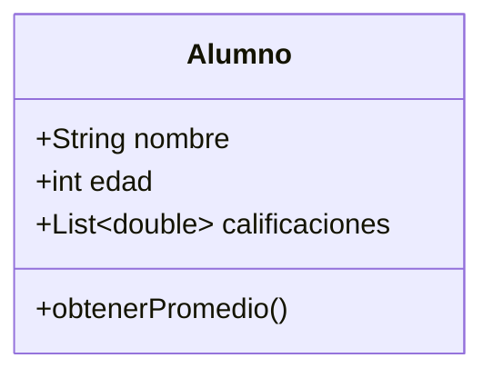
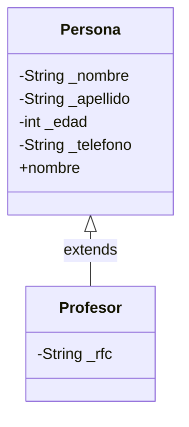
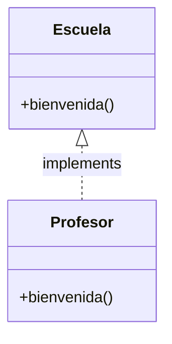
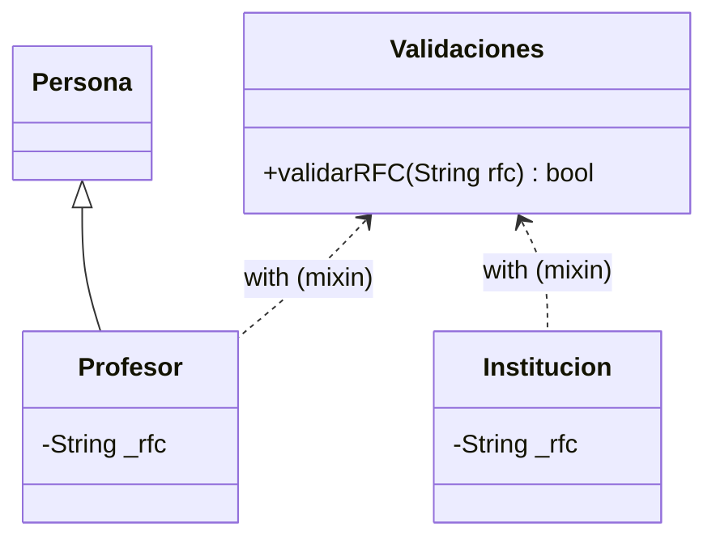

# Conceptos de Dart

Guía de referencia con lo aprendido en el [Curso profesional de Dart](https://codigofacilito.com/cursos/dart-profesional), organizada por tema. Los módulos con varios conceptos que se comparan entre sí incluyen una tabla de **vistazo rápido** antes del detalle; los módulos más cortos y lineales van directo a la explicación. Se completa a medida que avanzo en el curso.

## Índice
- [Conceptos de Dart](#conceptos-de-dart)
  - [Índice](#índice)
  - [Introducción a Dart](#introducción-a-dart)
  - [Variables y tipos](#variables-y-tipos)
    - [Vistazo rápido](#vistazo-rápido)
    - [En detalle](#en-detalle)
  - [Entrada y salida por consola](#entrada-y-salida-por-consola)
  - [Operadores](#operadores)
    - [Vistazo rápido](#vistazo-rápido-1)
    - [En detalle](#en-detalle-1)
  - [Sentencias condicionales y repetitivas](#sentencias-condicionales-y-repetitivas)
    - [Vistazo rápido](#vistazo-rápido-2)
    - [En detalle](#en-detalle-2)
  - [Listas y Mapas](#listas-y-mapas)
    - [Vistazo rápido](#vistazo-rápido-3)
    - [En detalle](#en-detalle-3)
  - [Funciones](#funciones)
    - [Vistazo rápido](#vistazo-rápido-4)
    - [En detalle](#en-detalle-4)
  - [Programación Orientada a Objetos (POO)](#programación-orientada-a-objetos-poo)
    - [Vistazo rápido](#vistazo-rápido-5)
    - [En detalle](#en-detalle-5)
  - [Programación asíncrona](#programación-asíncrona)
    - [Vistazo rápido](#vistazo-rápido-6)
    - [En detalle](#en-detalle-6)

---

## Introducción a Dart

**¿Qué es Dart?**

Dart es un lenguaje de programación creado por **Google**, específicamente por los ingenieros **Lars Bak** y **Kasper Lund** (los mismos que antes habían creado el motor V8 de JavaScript para Chrome). Está diseñado para construir aplicaciones móviles, web y de escritorio.

Es un lenguaje relativamente nuevo:

- Se presentó en la conferencia **GOTO**, en Aarhus (Dinamarca), en octubre de 2011. Originalmente el proyecto se llamaba **Dash**, y su objetivo era ofrecer una alternativa moderna a JavaScript para el desarrollo web.
- Su lanzamiento oficial (versión 1.0) fue el 14 de noviembre de 2013.
- A partir de la versión 1.3, su sintaxis y semántica se convirtieron en un **estándar de ECMA International**.

Al comienzo no tuvo mucha adopción, hasta la llegada de **Flutter** (diciembre de 2018), que impulsó fuertemente su uso.

**¿Por qué aprender Dart?**

1. **Fácil de aprender** — sintaxis similar a otros lenguajes conocidos (Java, C, JavaScript).
2. **Gran soporte de herramientas** — DartPad (editor online), Android Studio, IntelliJ IDEA.
3. **Código abierto** — licenciado bajo BSD, sin costos ni restricciones de uso por parte de una empresa.
4. **Gran comunidad** — repositorio oficial de paquetes en [pub.dev](https://pub.dev) y comunidad activa en GitHub.
5. **Respaldado por Google** — usado internamente por Google y por empresas como Alibaba, Adobe, Mailchimp y JetBrains.

**Compilación y ejecución**

**Compilar** es el proceso de traducir el código que escribe una persona a instrucciones que la máquina pueda ejecutar directamente. Dart soporta **dos formas distintas** de hacer esa traducción:

- **JIT (Just-In-Time — "justo a tiempo"):** el código se traduce **de a partes, en el momento en que se necesita**, mientras el programa ya está corriendo. Esto es lo que permite el *hot reload*: al modificar una línea de la app, Dart solo recompila esa parte modificada y la inyecta en la app que sigue corriendo, en vez de recompilar todo desde cero. Se usa en **desarrollo**, priorizando velocidad de iteración por sobre rendimiento final.

- **AOT (Ahead-of-Time — "por adelantado"):** todo el código se traduce **una sola vez, completo, antes de que el programa se ejecute** — igual que generar un `.exe`. No hay nada que compilar en el momento de correr la app, por eso arranca más rápido y rinde mejor. Se usa en **producción**.

Además, Dart puede **transcompilar** (traducir código de un lenguaje a otro, conservando su lógica) a JavaScript, lo que permite que el mismo código corra en navegadores.

**Comentarios en Dart**

Un **comentario** es una línea de texto que el compilador ignora al ejecutar el programa; sirve para dejar notas dentro del código.

```dart
// Comentario de una línea

/// Comentario de documentación (dartdoc)
/// Se usa para generar documentación automática del código

/**
 * Comentario de bloque tradicional
 * (menos común en el estilo idiomático de Dart)
 */
```

**Ejemplo práctico — Hola mundo**

```dart
void main() {
  print('Hello, Dantheon!');
}
```

> 📌 Dart no permite código ejecutable fuera de una función — todo el punto de entrada pasa por `main()`, la función que Dart ejecuta automáticamente al correr el programa.

---

## Variables y tipos

### Vistazo rápido

**Tipos de datos básicos**

| Tipo | Qué representa |
|---|---|
| `int` | Número entero |
| `double` | Número decimal |
| `String` | Texto |
| `bool` | `true` / `false` |

**Tipado flexible**

| Palabra clave | ¿Cambia el tipo al reasignar? | ¿Cambia el valor? |
|---|---|---|
| `dynamic` | Sí | Sí |
| `var` | No (queda fijo al inferido) | Sí |
| `final` | No aplica | No se reasigna (colección sí es mutable por dentro) |
| `const` | No aplica | No — inmutable por completo |

**Otros conceptos del módulo**

| Concepto | Qué es |
|---|---|
| Null safety (`?`) | Por defecto no se admite `null`; se habilita agregando `?` al tipo |
| Conversión de tipos | `.toInt()`, `.parse()`, `.toString()` — nunca ocurre de forma automática |
| Concatenación | Unir strings con el operador `+` |
| Interpolación | Insertar una variable dentro de un string con `$` o `${}` |
| Escape (`\`) | Usar literalmente un carácter especial (`\$`, `\"`, `\n`) |
| `'''texto'''` | String multilínea, sin necesidad de `\n` en cada salto |

### En detalle

**Declaración de variables**

Una **variable** es un espacio con nombre donde se guarda un valor para poder usarlo o modificarlo después. En Dart, la sintaxis básica es `tipo nombre = valor;` — el valor asignado debe corresponder al tipo declarado. Los strings admiten comillas simples o dobles indistintamente.

```dart
int edad = 22;
double precio = 19.99;
String nombre = "Dantheon";  // también válido: 'Dantheon'
bool esCliente = true;
```

**Tipos de datos básicos**

- **`int`:** números **enteros**, sin parte decimal (ej: `22`, `-5`, `1000`).
- **`double`:** números **decimales**, con parte fraccionaria (ej: `19.99`, `0.5`).
- **`String`:** **texto**, una cadena de caracteres delimitada por comillas simples o dobles.
- **`bool`:** valor **booleano**, que solo puede ser `true` o `false`. Se usa típicamente para condiciones o estados binarios.

**Tipado flexible: `dynamic`, `var`, `final`, `const`**

- **`dynamic`:** el tipo se resuelve **en tiempo de ejecución**, no al escribir el código. Permite reasignar un valor de **otro tipo** sin que Dart marque error. Es la opción más flexible, pero también la que menos protección da contra errores.

```dart
dynamic puntos = "2000";
puntos = 2000; // válido: cambia de String a int sin error
```

- **`var`:** Dart **infiere** el tipo automáticamente a partir del valor inicial, pero ese tipo queda **fijo** desde ese momento. Se puede cambiar el valor, no el tipo.

```dart
var puntos1 = 2000;
// puntos1 = "dos mil"; // ❌ error: puntos1 quedó fijado como int
```

- **`final`:** el **valor se asigna una sola vez** y no puede reasignarse. Esto aplica a la *referencia*, no necesariamente al contenido interno — si el valor es una colección, sí se pueden modificar sus elementos, porque la lista en sí sigue siendo el mismo objeto.

```dart
final puntos2 = [2000];
puntos2.add(5); // ✅ true — se modifica el contenido, no la referencia
```

- **`const`:** **100% inmutable**, tanto en su valor como en su contenido interno. A diferencia de `final`, ni siquiera se pueden modificar los elementos de una colección declarada como `const`.

```dart
const puntos3 = [1000];
// puntos3.add(5); // ❌ false — const es inmutable también por dentro
```

> 📌 **Sobre mayúsculas en constantes:** según el estilo oficial de Dart (*Effective Dart*), la convención recomendada para constantes es **lowerCamelCase** (`const defaultTimeout = 1000;`), no mayúsculas tipo Java (`PUNTOS3`). El uso de `SCREAMING_CAPS` está permitido solo por compatibilidad con código legacy. No es un error de sintaxis, pero no es el estándar actual de la comunidad Dart.

**Seguridad nula (null safety)**

**Null safety** es una característica del lenguaje que impide, por defecto, que una variable tenga valor `null` ("ningún valor"). El objetivo es evitar uno de los errores más comunes en programación: usar una variable que en realidad no tiene ningún valor cargado. Para permitir que una variable sí pueda ser `null`, hay que declararla explícitamente como **nullable**, agregando `?` después del tipo.

```dart
int numero = null;   // ❌ error: numero no admite null
int? numero = null;  // ✅ correcto: numero admite null explícitamente
```

**Conversión de tipos**

**Convertir un tipo** es transformar un valor de un tipo de dato a otro (ej: de texto a número). Dart es un lenguaje **fuertemente tipado**, lo que significa que esta conversión nunca ocurre de forma automática — siempre hay que pedirla explícitamente con un método.

```dart
int edad = (22.2).toInt();          // double -> int (trunca el decimal, no redondea)
double precio = double.parse("25"); // String -> double
int cantidad = int.parse("10");     // String -> int
String texto = 300.toString();      // número -> String
```

**Concatenación e interpolación de strings**

- **Concatenación:** unir dos o más cadenas de texto, una a continuación de la otra, con el operador `+`. Funciona entre literales y entre un literal y una variable, siempre que ambos sean `String`.

```dart
print("hola" + "mundo");   // holamundo
print("hola " + nombre);   // hola Dantheon
```

- **Interpolación:** insertar el valor de una variable **directamente dentro** de una cadena, con `$`, sin necesidad de `+`. Es más práctica y legible que la concatenación.

```dart
String nombre = "Dantheon";
print("hola $nombre");   // hola Dantheon
```

Cuando en vez de mostrar solo el valor se necesita **llamar a un método** dentro del string, se envuelve la expresión entre llaves `${}`:

```dart
print("hola ${nombre.length}"); // hola 8
```

**Escapar caracteres y strings multilínea**

**Escapar un carácter** es indicarle a Dart que ese carácter debe tratarse de forma **literal**, y no con el significado especial que normalmente tiene dentro de un string. Se hace con una barra invertida (`\`).

- `\$` → muestra el signo `$` literal, sin disparar interpolación.
- `\"` → permite usar comillas dobles dentro de un string ya delimitado por comillas dobles.
- `\n` → genera un salto de línea.

```dart
print("Precio: \$100");             // Precio: $100
print("Dantheon dijo: \"hola\"");   // Dantheon dijo: "hola"
```

Cuando un string necesita **varios** saltos de línea, es más práctico usar comillas triples (`'''`), que preservan los saltos y espacios tal como se escriben, sin `\n` en cada uno:

```dart
print('''Hola, Dantheon
Bienvenido a este curso
Espero que aprendas del lenguaje Dart''');
```

**Métodos útiles de String**

Un **método** es una función asociada a un tipo de dato, que se invoca sobre una variable de ese tipo para consultar o transformar su valor.

- **`.contains(texto)`:** `true`/`false` según si la cadena **contiene** la subcadena indicada.
- **`.isEmpty`:** `true` si la cadena **está vacía**.
- **`.isNotEmpty`:** `true` si la cadena **no está vacía**.
- **`.toUpperCase()`:** copia de la cadena en **mayúsculas**.
- **`.toLowerCase()`:** copia de la cadena en **minúsculas**.
- **`.substring(inicio)` / `.substring(inicio, fin)`:** **porción** de la cadena a partir del índice indicado; si se pasa un segundo número, corta justo antes de ese índice.
- **`.length`:** cantidad de **caracteres** de la cadena.
- **`.replaceAll(buscado, reemplazo)`:** copia con **todas** las coincidencias reemplazadas.

```dart
String nombre = "Dantheon";

nombre.contains("Dantheon");            // true
nombre.isEmpty;                         // false
nombre.isNotEmpty;                      // true
nombre.toUpperCase();                   // "DANTHEON"
nombre.toLowerCase();                   // "dantheon"
nombre.substring(3);                    // desde el índice 3 hasta el final
nombre.substring(3, 6);                 // desde el índice 3 hasta el 6
nombre.length;                          // 8
nombre.replaceAll("Dantheon", "Pepito"); // reemplaza todas las coincidencias
```

---

## Entrada y salida por consola

Para programas que corren directamente en consola (sin interfaz gráfica todavía), Dart ofrece `stdin` y `stdout` a través de la librería `dart:io`, que hay que importar al principio del archivo:

```dart
import 'dart:io';
```

| Función | Qué hace |
|---|---|
| `stdout.write(texto)` | Escribe en consola sin salto de línea al final (a diferencia de `print()`) |
| `stdin.readLineSync()` | Espera a que el usuario ingrese un valor por teclado y lo devuelve como `String` |

```dart
stdout.write("Ingresa tu nombre: ");
String? nombre = stdin.readLineSync();

stdout.write("Ingresa un número: ");
int numero = int.parse(stdin.readLineSync()!);
```

> 📌 `stdin.readLineSync()` siempre devuelve un `String` (o `null`), sin importar qué haya tipeado la persona. Por eso, si el dato ingresado se va a usar como número, hace falta convertirlo explícitamente con `int.parse()` o `double.parse()` antes de operar con él — es el mismo mecanismo de conversión de tipos visto en la sección anterior.

---

## Operadores

### Vistazo rápido

**Operadores de comparación**

| Operador | Qué evalúa |
|---|---|
| `>` | ¿Mayor que? |
| `<` | ¿Menor que? |
| `>=` | ¿Mayor o igual que? |
| `<=` | ¿Menor o igual que? |
| `==` | ¿Igual a? |
| `!=` | ¿Distinto de? |

**Operadores aritméticos**

| Operador | Qué hace |
|---|---|
| `+` | Suma |
| `-` | Resta |
| `*` | Multiplicación |
| `/` | División (siempre devuelve `double`) |
| `~/` | División entera (descarta el decimal) |
| `%` | Módulo (resto de la división) |
| `-x` | Unario: invierte el signo del valor |

**Operadores de asignación compuesta**

| Operador | Equivale a |
|---|---|
| `+=` | `a = a + b` |
| `-=` | `a = a - b` |
| `*=` | `a = a * b` |
| `/=` | `a = a / b` |
| `%=` | `a = a % b` |
| `~/=` | `a = a ~/ b` |

**Operadores lógicos**

| Operador | Qué hace |
|---|---|
| `&&` | Y lógico (AND) — ambas condiciones deben ser verdaderas |
| `\|\|` | O lógico (OR) — al menos una condición debe ser verdadera |

**Operadores de incremento y decremento**

| Operador | Qué hace |
|---|---|
| `++a` | Pre-incremento: suma 1 **antes** de usar el valor |
| `a++` | Post-incremento: usa el valor **y después** suma 1 |
| `--a` | Pre-decremento: resta 1 **antes** de usar el valor |
| `a--` | Post-decremento: usa el valor **y después** resta 1 |

**Operadores condicionales**

| Operador | Qué hace |
|---|---|
| `condición ? valorSiTrue : valorSiFalse` | Operador ternario: condensa un if/else en una sola línea |
| `valor ?? valorPorDefecto` | Operador null-aware: si `valor` es `null`, usa el valor por defecto |

### En detalle

**Operadores de comparación**

Los **operadores de comparación** evalúan la relación entre dos valores y siempre devuelven un `bool` (`true` o `false`).

```dart
int edad = 20;
int edadMin = 18;

edad > edadMin;   // true  — ¿edad es mayor que edadMin?
edad < edadMin;   // false — ¿edad es menor que edadMin?
edad >= edadMin;  // true  — ¿mayor o igual?
edad <= edadMin;  // false — ¿menor o igual?
edad == edadMin;  // false — ¿son iguales?
edad != edadMin;  // true  — ¿son distintos?
```

> 📌 `=` es el operador de **asignación** (guarda un valor en una variable); `==` es el operador de **comparación** (evalúa si dos valores son iguales). Son símbolos distintos con funciones distintas.

**Operadores aritméticos**

Los **operadores aritméticos** realizan operaciones matemáticas entre dos valores numéricos.

```dart
int a = 10;
int b = 3;

a + b;   // 13
a - b;   // 7
a * b;   // 30
a / b;   // 3.333... — la división normal siempre devuelve double
a ~/ b;  // 3 — división entera: descarta la parte decimal
a % b;   // 1 — módulo: el resto que queda de la división
```

El operador **unario** `-` invierte el signo de un valor (lo vuelve negativo si era positivo, o positivo si era negativo):

```dart
int x = 10;
print(-x); // -10
```

**Operadores de asignación compuesta**

Son un **atajo** para reasignar una variable aplicándole una operación aritmética con su propio valor actual. En vez de escribir la forma larga (`a = a + b`), se puede usar la forma corta (`a += b`) — ambas hacen exactamente lo mismo.

```dart
int a = 10;
int b = 5;

a += b; // equivale a: a = a + b  -> a vale 15
a -= b; // equivale a: a = a - b  -> a vale 5
a *= b; // equivale a: a = a * b  -> a vale 50
a /= b; // equivale a: a = a / b  -> a vale 2.0
a %= b; // equivale a: a = a % b  -> a vale 0
a ~/= b; // equivale a: a = a ~/ b -> a vale 2
```

**Operadores lógicos**

Los **operadores lógicos** combinan dos o más expresiones booleanas (`true`/`false`) en una sola condición.

- **`&&` (AND):** la condición completa es `true` solo si **ambos** lados son `true`.
- **`||` (OR):** la condición completa es `true` si **al menos uno** de los dos lados es `true`.

```dart
int edad = 20;
bool tieneEntrada = true;

// && : las dos condiciones deben cumplirse
print(edad >= 18 && tieneEntrada); // true

// || : alcanza con que se cumpla una
print(edad >= 18 || tieneEntrada); // true
```

**Operadores de incremento y decremento**

Son un atajo para sumar o restar 1 al valor de una variable. La diferencia entre la versión "pre" y "post" está en **cuándo** ocurre el cambio en relación al uso del valor:

- **Pre-incremento (`++a`):** suma 1 **antes** de que el valor se use en la expresión — por eso, al imprimirlo en el mismo momento, ya se muestra el valor actualizado.
- **Post-incremento (`a++`):** usa el valor **tal como estaba**, y recién después le suma 1 — por eso, al imprimirlo en el mismo momento, se muestra el valor viejo, y solo a partir de la siguiente línea aparece actualizado.

```dart
int a = 10;

print("pre-incremento: ${++a}"); // 11 — ya sumó antes de mostrar
print("valor de a: $a");         // 11

int b = 10;

print("post-incremento: ${b++}"); // 10 — muestra el valor viejo
print("valor de b: $b");          // 11 — ahora sí quedó actualizado
```

Lo mismo aplica para `--a` y `a--`, pero restando en vez de sumando.

**Operadores condicionales**

**Operador ternario (`?:`):** condensa una estructura `if/else` simple en una sola línea. Se lee: "si la condición es verdadera, devolvé el primer valor; si no, devolvé el segundo".

```dart
int edad = 20;
int edadMin = 18;

print((edad >= edadMin) ? "Dantheon puede entrar" : "Dantheon no puede entrar");
// Dantheon puede entrar
```

**Operador null-aware (`??`):** devuelve el valor de la izquierda si **no** es `null`; si es `null`, devuelve el valor de la derecha como respaldo.

```dart
int? x;
print(x ?? 10); // 10 — como x es null, usa el valor por defecto
```

---

## Sentencias condicionales y repetitivas

### Vistazo rápido

**Condicionales**

| Sentencia | Qué hace |
|---|---|
| `if` | Ejecuta un bloque solo si la condición es `true` |
| `else if` | Evalúa una condición adicional si la anterior fue `false` |
| `else` | Bloque final que corre si ninguna condición anterior se cumplió |
| `switch` | Compara una variable contra varios valores posibles (`case`) |

**Repetitivas**

| Sentencia | Qué hace |
|---|---|
| `for` | Repite un bloque un número definido de veces (con contador) |
| `for...in` | Recorre cada elemento de una colección o estructura iterable (equivalente a un "foreach") |
| `while` | Repite un bloque **mientras** la condición sea `true` (puede no ejecutarse nunca) |
| `do...while` | Igual que `while`, pero ejecuta el bloque **al menos una vez** antes de evaluar la condición |

### En detalle

**if / else if / else**

Una estructura **condicional** ejecuta distintos bloques de código según si una condición es verdadera o falsa.

```dart
int calificacion = 7;
int calificacionMin = 6;

if (calificacion >= calificacionMin) {
  print("Pasaste");
} else {
  print("No pasaste");
}
```

Cuando hay **más de dos** caminos posibles, se encadenan condiciones con `else if`. Dart evalúa cada condición **en orden**, de arriba hacia abajo, y ejecuta solo el primer bloque cuya condición sea `true` — el resto se ignora, aunque también fueran verdaderas.

```dart
int calificacion = 8;

if (calificacion == 9) {
  print("Muy bien");
} else if (calificacion == 8) {
  print("Bien");
} else if (calificacion == 7) {
  print("Regular");
} else {
  print("No pasaste");
}
```

**switch**

`switch` compara el valor de una variable contra una lista de casos posibles (`case`), y ejecuta el bloque del primer caso que coincida. Cada `case` necesita terminar con `break` para no seguir evaluando los siguientes; `default` es el caso que corre si ninguno de los anteriores coincidió (equivalente al `else` final de un `if`).

```dart
int calificacion = 9;

switch (calificacion) {
  case 9:
    print("Muy bien");
    break;
  case 8:
    print("Bien");
    break;
  default:
    print("No pasaste");
}
```

**for**

El bucle `for` repite un bloque de código un número definido de veces, controlado por un **contador**. Tiene tres partes separadas por `;`: valor inicial, condición de corte, e incremento.

```dart
for (int i = 1; i <= 10; i++) {
  print(i);
}
```

**Ciclos anidados:** un `for` colocado **dentro** de otro `for`. El ciclo interno se ejecuta completo por cada vuelta del ciclo externo — útil, por ejemplo, para recorrer una tabla (filas y columnas).

```dart
for (int fila = 1; fila <= 3; fila++) {
  for (int columna = 1; columna <= 3; columna++) {
    print("Fila $fila, columna $columna");
  }
}
```

**for...in (equivalente al "foreach")**

Dart no tiene una palabra clave llamada `foreach`. Lo que cumple esa función es el bucle **`for...in`**: recorre, uno por uno, todos los elementos de una estructura iterable (como una lista o los caracteres de un string), sin necesidad de manejar un contador manualmente.

```dart
String nombre = "Dantheon";

for (int codigo in nombre.codeUnits) {
  print(String.fromCharCode(codigo));
}
```

> 📌 `nombre.codeUnits` devuelve la lista de códigos numéricos (UTF-16) de cada carácter del string. `String.fromCharCode(codigo)` hace el proceso inverso: convierte ese código numérico de vuelta en el carácter que representa. Por separado, las listas también tienen un **método** `.forEach()` (con paréntesis, distinto del bucle `for...in`) que recibe una función y la ejecuta por cada elemento — se desarrolla en el módulo de Listas y Mapas.

**while**

`while` repite un bloque **mientras** la condición siga siendo `true`. La condición se evalúa **antes** de cada vuelta — si es falsa desde el inicio, el bloque no se ejecuta ni una sola vez.

```dart
int edad = 15;

while (edad <= 18) {
  print("Tiene $edad años");
  edad++;
}
```

**do...while**

Funciona igual que `while`, con una diferencia clave: el bloque se ejecuta **al menos una vez**, porque la condición se evalúa **al final**, después de correr el bloque por primera vez.

```dart
int edad = 20;

do {
  print("Tiene $edad años");
  edad++;
} while (edad <= 18);
// Se imprime una vez igual, aunque la condición ya era falsa desde el inicio
```

---

## Listas y Mapas

### Vistazo rápido

> Se usa el término **mutar** para referirse a cuando un método modifica la colección original directamente, en vez de devolver una nueva. Las tablas siguientes marcan cada método con *(muta)* o *(no muta)* según corresponda.

**Listas — operaciones básicas**

| Operación | Sintaxis |
|---|---|
| Declarar | `List<tipo> nombre = [valor1, valor2];` |
| Leer por índice | `lista[indice]` |
| Modificar por índice | `lista[indice] = nuevoValor;` |
| Agregar al final | `lista.add(valor);` |
| Quitar por índice | `lista.removeAt(indice);` |

**Listas — formas de recorrer**

| Forma | Cuándo usarla |
|---|---|
| `for` con índice | Cuando además se necesita conocer la **posición** de cada elemento |
| `for...in` | Cuando solo se necesita el **valor** de cada elemento, sin su posición |
| `.forEach()` | Igual que `for...in`, pero como método con función — más compacto |

**Listas — métodos útiles**

| Método | Qué hace |
|---|---|
| `.sublist(inicio, fin)` | Devuelve una porción de la lista *(no muta)* |
| `.shuffle()` | Reordena los elementos al azar *(muta)* |
| `.reversed` | Devuelve los elementos en orden inverso *(no muta)* |
| `.where(condición)` | Filtra los elementos que cumplen una condición *(no muta)* |
| `.map(función)` | Transforma cada elemento aplicando una función, y devuelve una nueva colección con los resultados *(no muta)* |
| `.sort([comparador])` | Ordena los elementos de la lista *(muta)* |
| `.reduce(función)` | Combina todos los elementos en un único valor, arrancando desde el primer elemento *(no muta)* |
| `.fold(inicial, función)` | Igual que `.reduce()`, pero con un valor inicial explícito *(no muta)* |

**Mapas — operaciones básicas**

| Operación | Sintaxis |
|---|---|
| Declarar | `Map<K, V> nombre = {"clave": "valor"};` |
| Leer por clave | `mapa["clave"]` |
| Modificar por clave | `mapa["clave"] = nuevoValor;` |
| Agregar clave nueva | `mapa["claveNueva"] = valor;` |
| Quitar por clave | `mapa.remove("clave");` |

**Mapas — formas de recorrer**

| Forma | Qué recorre |
|---|---|
| `for (... in mapa.keys)` | Solo las **claves** |
| `for (... in mapa.values)` | Solo los **valores** |
| `for (... in mapa.entries)` | Pares clave-valor juntos (`MapEntry`) |
| `.forEach((k, v) => ...)` | Clave y valor juntos, como método con función |

### En detalle

**Listas**

Una **lista** (`List`) es una colección **ordenada** de valores, donde cada elemento tiene una posición numérica (**índice**), empezando en `0`. Permite valores repetidos.

```dart
List<String> colores = ["rojo", "azul", "verde", "negro"];
print(colores[1]); // azul — accede al elemento en el índice 1
```

> 📌 **Sobre el tipo de la lista:** al declarar `List<tipo>`, Dart exige que todos los elementos sean de ese tipo — es lo que da protección contra errores. Si se mezclan tipos distintos sin indicar `<tipo>` (por ejemplo, strings y un número en la misma lista), Dart infiere automáticamente `List<dynamic>`, que acepta cualquier tipo pero pierde esa protección. Es válido, pero conviene ser explícito con el tipo salvo que el caso realmente requiera mezclar tipos.

Modificar, agregar y quitar elementos:

```dart
colores[2] = "amarillo";   // modifica el elemento en el índice 2
colores.add("gris");       // agrega al final
colores.removeAt(0);       // quita el elemento en el índice 0
```

**Recorrer una lista** — tres formas equivalentes, cada una con su caso de uso:

```dart
// 1. for con índice — útil cuando se necesita conocer la posición
for (int i = 0; i < colores.length; i++) {
  print(colores[i]);
}
```

> 📌 Los índices válidos de una lista van de `0` a `length - 1`. La condición de corte debe ser `i < lista.length`; usar `i <= lista.length` genera un error (`RangeError`) en la última vuelta, porque intenta leer una posición que no existe.

```dart
// 2. for...in — más simple cuando solo se necesita el valor, sin la posición
for (String color in colores) {
  print(color);
}

// 3. .forEach() — mismo resultado que for...in, con sintaxis de función
colores.forEach((color) => print(color));
```

**Métodos útiles de lista**

```dart
List<String> colores = ["rojo", "azul", "verde", "negro", "morado"];

colores.sublist(1, 3);  // ["azul", "verde"] — porción entre los índices 1 y 3 (sin incluir el 3), no muta
colores.shuffle();      // reordena los elementos al azar — muta la lista original
colores.reversed;       // orden inverso — no muta, devuelve un resultado nuevo
colores.where((color) => color == "morado"); // elementos que cumplen la condición — no muta
```

`.map()` transforma cada elemento de la lista aplicando la misma función, y devuelve una nueva colección con los valores ya transformados — a diferencia de `.where()`, que filtra sin cambiar los valores, `.map()` cambia los valores sin filtrar:

```dart
List<int> numeros = [1, 2, 3, 4];

numeros.map((numero) => numero * 2); // (2, 4, 6, 8) — cada elemento, multiplicado por dos
```

> 📌 `.map()` devuelve un `Iterable`, no un `List` directamente. Si se necesita usarlo como lista (por ejemplo, para acceder por índice o volver a usar `.add()`), hay que convertirlo explícitamente con `.toList()`: `numeros.map((n) => n * 2).toList()`.

`.sort()` ordena los elementos de la lista. Sin argumentos, usa el orden natural del tipo (alfabético para `String`, ascendente para números). Para especificar el criterio de orden (por ejemplo, ordenar objetos por uno de sus atributos), se le pasa una función comparadora:

```dart
List<String> nombres = ["Carla", "Ana", "Beto"];
nombres.sort(); // ["Ana", "Beto", "Carla"] — alfabético por defecto

List<int> precios = [80, 10, 120];
precios.sort((a, b) => a.compareTo(b)); // [10, 80, 120] — ascendente, explícito
```

> 📌 `.sort()` **muta** la lista original (la reordena en el lugar, no devuelve una nueva) — a diferencia de `.where()`, `.map()`, `.reduce()` y `.fold()`.

> 📌 `.shuffle()` y `.sort()` **mutan** la lista original (no devuelven una nueva). `.reversed`, `.where()`, `.map()`, `.sublist()`, `.reduce()` y `.fold()` **no mutan**: devuelven un resultado nuevo para usar o guardar aparte, sin tocar la lista de origen.

`.reduce()` y `.fold()` combinan todos los elementos de una lista en un único valor, aplicando la misma función acumulativa a cada elemento. La diferencia es de dónde arranca el "acumulador":

```dart
List<int> numeros = [1, 2, 3, 4];

// reduce: arranca usando el PRIMER elemento de la lista como valor inicial
numeros.reduce((valor, elemento) => valor + elemento); // 10

// fold: arranca desde un valor inicial definido explícitamente en el código
var resultado = numeros.fold(10, (valor, elemento) => valor + elemento); // 20
```

> 📌 `.reduce()` falla con error si la lista está vacía (no tiene de dónde sacar el primer valor). `.fold()` sí funciona con listas vacías, porque el valor inicial ya viene dado — por eso es la opción más segura cuando no se puede garantizar que la lista tenga al menos un elemento.

**Mapas**

Un **mapa** (`Map`) es una colección de pares **clave-valor**: en vez de acceder por posición numérica como en una lista, se accede por una **clave** única. Es la versión en Dart de lo que en otros lenguajes se conoce como diccionario o arreglo asociativo — cada clave apunta a un valor específico, y no puede haber dos claves iguales dentro del mismo mapa.

```dart
Map<String, String> datos = {
  "nombre": "Dantheon",
  "apellido": "Programador",
  "telefono": "0000000021231232",
};

print(datos["nombre"]); // Dantheon — accede por clave, no por índice
```

Modificar, agregar y quitar:

```dart
datos["apellido"] = "Full Stack";            // modifica el valor de una clave existente
datos["email"] = "dantheoncode@gmail.com";   // agrega una clave nueva (misma sintaxis que modificar)
datos.remove("nombre");                      // quita la clave "nombre" y su valor
```

> ⚠️ Al remover, la clave va entre comillas (`datos.remove("nombre")`), porque es un `String` literal — sin las comillas, Dart buscaría una variable llamada `nombre`, no la clave de texto.

**Recorrer un mapa** — a diferencia de una lista, un mapa tiene **cuatro** formas distintas de recorrerse, según qué parte del par clave-valor se necesite:

```dart
// 1. Solo las claves
for (String key in datos.keys) {
  print("key: $key valor: ${datos[key]}");
}

// 2. Solo los valores
for (String value in datos.values) {
  print("valor: $value");
}

// 3. Clave y valor juntos, como un objeto MapEntry
for (MapEntry entry in datos.entries) {
  print("clave: ${entry.key} valor: ${entry.value}");
}

// 4. Clave y valor juntos, con forEach
datos.forEach((k, v) => print("key: $k valor: $v"));
```

> 📌 `MapEntry` es un tipo especial de Dart que representa un par clave-valor individual — por eso tiene las propiedades `.key` y `.value`, para acceder a cada parte por separado.

---

## Funciones

### Vistazo rápido

**Tipos de parámetros**

| Tipo | Sintaxis | ¿Obligatorio enviarlo al llamar? | ¿Cómo se identifica al llamar? |
|---|---|---|---|
| Requerido | `tipo nombre` | Sí | Por posición |
| Opcional posicional | `[tipo nombre]` | No | Por posición (el orden en que se escribe) |
| Opcional nombrado | `{tipo nombre}` | No | Por nombre (`nombre: valor`) — el orden no importa |

### En detalle

**Declarar y llamar una función**

Una **función** es un bloque de código reutilizable, identificado con un nombre, que puede ejecutarse cuantas veces se necesite con una sola línea (llamándola por su nombre). Usarlas ayuda a mantener el código ordenado y evita repetir la misma lógica en varios lugares.

```dart
void bienvenida() {
  print("Bienvenido al repo de Dart");
}

void main() {
  bienvenida(); // llamar a la función
}
```

**Parámetros y argumentos**

Un **parámetro** es la variable que se declara en la definición de la función, como marcador de lo que va a recibir. Un **argumento** es el valor real que se envía al llamarla. Es decir: `nombre` es el parámetro; `"Dantheon"` es el argumento.

```dart
void bienvenida(String nombre) {
  print("$nombre, bienvenido");
}

void main() {
  bienvenida("Dantheon"); // "Dantheon" es el argumento
}
```

Una función puede recibir varios parámetros, y dentro de su cuerpo usar cualquier otra estructura ya vista (como `switch`) para decidir su comportamiento:

```dart
void bienvenida(String nombre, String tipo) {
  int descuento;

  switch (tipo) {
    case "nuevo":
      descuento = 50;
      break;
    case "antiguo":
      descuento = 70;
      break;
    default:
      descuento = 0;
  }

  print("$nombre, bienvenido al repo de Dart");
  print("Descuento asignado: $descuento%");
}
```

**Tipos de parámetros**

Los parámetros **requeridos** son obligatorios: la función no se puede llamar sin enviarlos.

```dart
void bienvenida(String nombre) {
  print("$nombre, bienvenido");
}
```

Los parámetros **opcionales** pueden enviarse o no al llamar a la función. Dart ofrece dos formas de declararlos, y **no se pueden combinar ambas en la misma función** — se elige una u otra:

- **Opcional posicional**, entre corchetes `[]`: se identifica por su posición, igual que un parámetro requerido, pero es opcional.
- **Opcional nombrado**, entre llaves `{}`: se identifica **por nombre** al momento de llamarlo, lo que hace más claro qué representa cada valor enviado — útil cuando una función recibe varios parámetros del mismo tipo y su orden podría confundirse.

```dart
// Opcional posicional
void bienvenida(String nombre, [int descuento = 0]) {
  print("$nombre, bienvenido. Descuento: $descuento%");
}

// Opcional nombrado
void bienvenida(String nombre, {int descuento = 0}) {
  print("$nombre, bienvenido. Descuento: $descuento%");
}

void main() {
  bienvenida("Dantheon");                       // usa el valor por defecto
  bienvenida("Dantheon", 10);                   // posicional: se pasa directo
  bienvenida("Dantheon", descuento: 10);         // nombrado: se indica el nombre del parámetro
}
```

> 📌 Un parámetro opcional necesita **un valor por defecto** (como `= 0` en el ejemplo) o ser declarado como *nullable* (`int? descuento`) — de lo contrario, Dart no permite omitirlo al llamar la función, ya que por null safety ninguna variable puede quedar sin valor.

**Orden de los parámetros:** los requeridos siempre van primero; los opcionales (posicionales o nombrados) van al final.

**Devolver un valor**

Una función puede **devolver** un resultado usando `return`, en vez de solo imprimir o ejecutar una acción. Cuando una función devuelve un valor, su tipo se especifica **antes** del nombre de la función (en vez de `void`, que indica que no devuelve nada).

```dart
double calcularTotal(double precio, double descuento) {
  return precio - descuento;
}

void main() {
  double total = calcularTotal(100, 20);
  print(total); // 80.0
}
```

---

## Programación Orientada a Objetos (POO)

POO es un **paradigma de programación**: una forma particular de organizar el código, basada en modelar el problema como un conjunto de **clases** y **objetos**, en vez de solo una secuencia de instrucciones. Dart comparte varios conceptos con lenguajes como C# o Java, pero difiere en detalles importantes — sobre todo en cómo maneja las interfaces, que se marcan en cada sección donde aplica.

### Vistazo rápido

**Conceptos generales**

| Concepto | Qué es |
|---|---|
| Clase | Molde que define los atributos y métodos comunes a un tipo de objeto |
| Objeto | Instancia concreta creada a partir de una clase |
| Atributo | Variable que guarda el estado de un objeto |
| Método | Función asociada a una clase, que define su comportamiento |
| Constructor | Método especial que se ejecuta al crear un objeto, para inicializar sus atributos |
| Encapsulación | Ocultar el estado interno de un objeto y controlar su acceso desde afuera |
| Herencia | Una clase hija hereda atributos y métodos de una clase padre |
| Clase abstracta | Clase que no puede instanciarse directamente; sirve de base para otras clases |
| Interfaz implícita | Contrato que una clase debe cumplir, sin heredar su implementación |
| Mixin | Forma de reutilizar código entre distintas jerarquías de clases, sin relación de herencia |

**`extends` vs `implements` vs `with` — la comparación clave del módulo**

| Palabra clave | Qué transmite a la clase hija | ¿Cuántas veces se puede usar por clase? |
|---|---|---|
| `extends` | Atributos y métodos **con su implementación incluida** (se heredan) | Una sola vez |
| `implements` | Solo la **forma** del contrato (nombres de métodos/atributos) — obliga a reescribir todo desde cero | Varias veces (se pueden implementar varios contratos) |
| `with` (mixin) | Código reutilizable, sin relación de herencia formal entre las clases | Varias veces |

**Modificadores de acceso**

| Modificador | Sintaxis | Alcance |
|---|---|---|
| Público | Nombre normal | Accesible desde cualquier archivo que importe la clase |
| Privado | Prefijo `_` | Accesible solo dentro del mismo **archivo** (library) — no solo dentro de la misma clase |

### En detalle

**Clases y objetos**

Una **clase** define la estructura (atributos) y el comportamiento (métodos) que van a tener sus instancias. Un **objeto** es cada instancia concreta creada a partir de esa clase — la clase es el molde, el objeto es lo que se produce con ese molde.



```dart
class Alumno {
  String nombre;
  int edad;
  List<double> calificaciones;

  // Constructor: recibe los valores e inicializa los atributos directamente
  Alumno(this.nombre, this.edad, this.calificaciones);

  void obtenerPromedio() {
    double suma = calificaciones.reduce((valor, elemento) => valor + elemento);
    double promedio = suma / calificaciones.length;
    print("El promedio de $nombre es de $promedio");
  }
}

void main() {
  Alumno dantheon = Alumno("Dantheon", 20, [8.5, 9.0, 7.5]);
  dantheon.obtenerPromedio(); // El promedio de Dantheon es de 8.333333333333334
}
```

**Constructores con parámetros opcionales**

Además del constructor principal, una clase puede tener **constructores con nombre**, útiles para ofrecer una forma alternativa de crear el objeto (por ejemplo, con valores por defecto si no se especifican):

```dart
class Alumno {
  String nombre;
  int edad;
  List<double> calificaciones;

  Alumno(this.nombre, this.edad, this.calificaciones);

  // Constructor con nombre, con parámetros opcionales nombrados
  Alumno.vacio({this.nombre = "", this.edad = 0, this.calificaciones = const []});
}
```

**Modificadores de acceso**

Dart tiene dos niveles de acceso: **público** (por defecto, sin marcar nada) y **privado** (anteponiendo un guion bajo `_` al nombre). La diferencia con lenguajes como C# está en el **alcance** de lo privado: en C#, `private` limita el acceso a la misma clase; en Dart, el guion bajo limita el acceso al mismo **archivo** (library) donde se declaró — lo que significa que dos clases distintas escritas en el mismo archivo sí pueden acceder a los miembros privados una de la otra, algo que en C# no sería posible con `private`.

```dart
class Alumno {
  String _nombre; // privado: solo accesible dentro de este archivo

  Alumno(this._nombre);
}
```

**Encapsulación**

**Encapsular** es agrupar los datos (atributos) y los métodos que operan sobre esos datos dentro de una misma clase, controlando cómo se accede o modifica ese estado desde afuera — en vez de dejar los atributos completamente abiertos y modificables sin control.

Un mecanismo típico para lograr esto son los **getters** y **setters**: métodos especiales que permiten leer (`get`) o modificar (`set`) un atributo privado de forma controlada, sin exponerlo directamente. Se acceden **igual que un atributo normal, sin paréntesis** — esa es la diferencia con un método común.

```dart
class Alumno {
  String _nombre;

  Alumno(this._nombre);

  String get nombre => _nombre;
  set nombre(String valor) => _nombre = valor;
}

void main() {
  Alumno dantheon = Alumno("Dantheon");
  print(dantheon.nombre);   // se lee sin paréntesis, como un atributo
  dantheon.nombre = "Nuevo Nombre"; // se asigna igual que un atributo
}
```

> 📌 En Dart, un campo público (`String nombre;`, sin `_`) y un getter/setter que expone un campo privado son **indistinguibles** desde el código que los usa — ambos se acceden con `objeto.nombre`, sin paréntesis. Por eso la convención del lenguaje es empezar con un campo público simple, y recién agregar getters/setters cuando se necesita lógica extra (validación, cálculo), sin que eso obligue a cambiar el código que ya usaba ese atributo.

**Herencia**

La **herencia** permite que una clase (hija) reciba los atributos y métodos de otra clase (padre), usando la palabra clave `extends`. La clase hija recibe la implementación completa del padre, y puede agregar sus propios atributos y métodos adicionales.



```dart
class Persona {
  String _nombre = "";
  String _apellido = "";
  int _edad = 0;
  String _telefono = "";

  String get nombre => _nombre;
  set nombre(String valor) => _nombre = valor;
}

class Profesor extends Persona {
  String _rfc = "";
}
```

Una clase solo puede heredar de **una única** clase padre con `extends` — intentar extender de dos clases a la vez produce un error de compilación:

```dart
// ❌ Error: una clase no puede extender dos clases a la vez
class Profesor extends Persona, Ingeniero { }
```

**Clases abstractas**

Una **clase abstracta** no puede instanciarse directamente — no se puede crear un objeto a partir de ella con `Clase()`. Sirve como base o plantilla para que otras clases hereden de ella, obligando (opcionalmente) a que las clases hijas implementen ciertos métodos.

```dart
abstract class Persona {
  String get nombre;
}

// ❌ Error: no se puede instanciar una clase abstracta directamente
// Persona persona = Persona();

// ✅ Se instancia a través de una clase hija concreta
class Profesor extends Persona {
  @override
  String get nombre => "Dantheon";
}
```

**Interfaces implícitas — la diferencia clave con C#**

Esta es la parte del módulo donde Dart se comporta distinto a lenguajes como C#, y vale la pena detenerse.

En C#, una interfaz necesita una palabra clave dedicada para existir:

```csharp
// C#
interface IEscuela {
    void Bienvenida();
}
```

**En Dart no existe esa obligación.** Cualquier clase normal, sin ninguna marca especial, funciona automáticamente como una interfaz implícita — el "contrato" que ofrece son los nombres y firmas de sus métodos y atributos públicos. No hace falta declararla de ninguna forma distinta a como se declara cualquier otra clase:

```dart
// Una clase Dart común y corriente — nada indica "esto es una interfaz"
class Escuela {
  void bienvenida() {
    print("Bienvenido a la escuela");
  }
}
```

**El momento exacto en el que esa clase empieza a funcionar como interfaz** no es cuando se la declara, sino cuando **otra clase la usa con `implements` en vez de `extends`**:



```dart
class Profesor implements Escuela {
  @override
  void bienvenida() {
    print("Bienvenido, soy profesor");
  }
}
```

Al usar `implements`, Dart exige que `Profesor` reescriba **todos** los métodos públicos de `Escuela` desde cero (por eso el `@override`) — a diferencia de `extends`, `implements` **no** hereda ninguna implementación, solo obliga a cumplir la misma forma.

**Resumen de la diferencia:** en C#, una clase "es" una interfaz desde el momento en que se declara con la palabra `interface`. En Dart, cualquier clase "se convierte" en interfaz según **cómo la use otra clase** — la palabra `implements` es la que dispara ese comportamiento, no una marca en la clase original.

> 📌 Desde la versión 3.0 del lenguaje, Dart agregó un modificador **opcional** `interface` (`interface class Escuela { }`) que restringe una clase para que solo pueda usarse con `implements` desde otros archivos, no con `extends`. Es un mecanismo para autores de paquetes que quieren dejar explícita esa intención — pero sigue sin ser obligatorio como en C#: sin ese modificador, cualquier clase común ya puede cumplir el rol de interfaz.

**Mixins**

Un **mixin** es una forma de reutilizar código entre clases que no comparten una relación de herencia directa, usando la palabra clave `with`. Es útil para casos donde varias clases —sin parentesco entre sí— necesitan compartir el mismo comportamiento, sin forzar una jerarquía de herencia artificial.



> 📌 RFC (Registro Federal de Contribuyentes) es el identificador fiscal usado en México — equivalente al CUIT en Argentina o al NIF en España. Se usa acá como dato de ejemplo, sin relevancia especial más allá de servir de valor a validar.

El siguiente ejemplo aplica el mismo mixin a **dos clases sin relación de herencia entre sí** (`Profesor` sí extiende de `Persona`; `Institucion` no extiende de nada) — esto es lo que muestra el verdadero valor de un mixin: el mismo código reutilizado en jerarquías completamente distintas, sin necesidad de que compartan un ancestro común.

```dart
mixin Validaciones {
  bool validarRFC(String rfc) {
    if (rfc.length >= 10) {
      return true;
    } else {
      return false;
    }
  }
}

class Profesor extends Persona with Validaciones {
  String _rfc = "";
}

class Institucion with Validaciones {
  String _rfc = "";
}

void main() {
  Profesor profesor = Profesor();
  print(profesor.validarRFC("ABC1234567")); // true

  Institucion escuela = Institucion();
  print(escuela.validarRFC("XYZ98765")); // false — mismo método, en una clase sin relación con Persona
}
```

Una clase puede combinar `extends` (una sola vez) **junto con** `with` (varias veces) — eso es justamente lo que resuelve el mixin: la limitación de herencia simple de `extends` no aplica a `with`, porque no es una relación de herencia formal.

---

## Programación asíncrona

### Vistazo rápido

**Conceptos generales**

| Concepto | Qué es |
|---|---|
| Síncrono | El código se ejecuta en orden: cada instrucción espera a que la anterior termine |
| Asíncrono | Permite que una operación en espera (un temporizador, una petición de red) no bloquee el resto del programa mientras se resuelve |
| `Future<T>` | Representa un valor de tipo `T` que va a estar disponible más adelante, no de forma inmediata |
| `async` | Marca una función como asíncrona; habilita el uso de `await` dentro de ella |
| `await` | Pausa la ejecución de esa función `async` puntual hasta que el `Future` se resuelva |

**Formas de manejar el resultado de un `Future`**

| Forma | ¿Cuándo se ejecuta? |
|---|---|
| `.then()` | Solo si el `Future` se resolvió con éxito |
| `.catchError()` | Solo si el `Future` terminó en error |
| `.whenComplete()` | Siempre, haya terminado con éxito o con error |
| `try` / `catch` + `await` | Alternativa a `.catchError()`, usando la sintaxis de `await` |

### En detalle

**Código síncrono**

Por defecto, Dart ejecuta el código de forma **síncrona**: una instrucción se ejecuta completa antes de pasar a la siguiente, sin excepciones.

```dart
void main() {
  inicio();
  accion();
  fin();
}

void inicio() {
  print("Inicio");
}

void accion() {
  for (int i = 0; i <= 10; i++) {
    print("Accion $i");
  }
}

void fin() {
  print("Fin");
}
```

En este ejemplo, `fin()` **siempre** se ejecuta después de que `accion()` termine por completo su bucle — no hay forma de que se adelante, porque el código corre en ese orden estricto.

**Future**

Un **`Future`** representa un valor que todavía no está disponible, pero lo va a estar en algún momento (por ejemplo, después de esperar una respuesta de red, o un tiempo determinado). Para que una función sea asíncrona, se marca con la palabra clave `async`.

```dart
Future<String> accion() async {
  return Future.delayed(Duration(seconds: 4), () => "Listo...");
}
```

`Future.delayed()` crea un `Future` que se resuelve después del tiempo indicado (`Duration`), devolviendo el valor que produce la función que recibe como segundo argumento.

**`.then()`, `.catchError()` y `.whenComplete()`**

Estos tres métodos permiten reaccionar al resultado de un `Future`, cada uno en un momento distinto:

- **`.then()`** ejecuta un bloque de código cuando el `Future` se resuelve **con éxito**, recibiendo el valor resultante como parámetro.

```dart
accion().then((value) {
  print("Este es el mensaje: $value");
});
```

- **`.catchError()`** ejecuta un bloque solo si el `Future` termina **en error**, recibiendo ese error como parámetro.

- **`.whenComplete()`** ejecuta un bloque siempre, sin importar si el resultado fue éxito o error — útil, por ejemplo, para ocultar un indicador de carga que debía mostrarse mientras se esperaba el resultado.

Los tres se pueden encadenar en una sola secuencia:

```dart
accion()
    .then((value) {
      print("Este es el mensaje: $value");
    })
    .catchError((error) {
      print("Este es el error: ${error.toString()}");
    })
    .whenComplete(() {
      print("La operación finalizó");
    });
```

**`await`**

`await` pausa la ejecución **de esa función `async`** hasta que el `Future` que está esperando se resuelva — recién ahí continúa con la siguiente línea. Solo puede usarse dentro de una función marcada como `async`.

```dart
void main() async {
  inicio();
  String value = await accion();
  print("Este es el valor: $value");
  fin();
}
```

En este caso, `"Este es el valor: ..."` y `fin()` no se ejecutan hasta que `accion()` termine de resolverse — la línea con `await` actúa como punto de espera dentro de esa función.

> 📌 Marcar una función como `async` no crea un hilo nuevo ni bloquea el resto del programa: mientras una función `async` está en la parte de `await`, el resto de la aplicación puede seguir respondiendo con normalidad. La pausa aplica solo a esa función puntual, no al programa completo.

**`try` / `catch` con `await`**

Es una forma alternativa a `.catchError()` para manejar errores, usando la sintaxis habitual de `try`/`catch` junto con `await`:

```dart
void main() async {
  inicio();

  try {
    String value = await accion();
    print("Este es el valor: $value");
  } catch (error) {
    print("Este es el error: ${error.toString()}");
  }

  fin();
}
```

**`Stream`**

Un `Future` resuelve **un único valor, una sola vez**. Un **`Stream`** es la versión de "varios valores a lo largo del tiempo": una secuencia de eventos asíncronos que se van emitiendo uno tras otro, sin saber de antemano cuántos van a llegar ni cuándo termina.

> 📌 Caso típico: la ubicación GPS de un usuario (o el recorrido de un conductor en una app de viajes). No alcanza con pedirla una sola vez — hace falta ir recibiendo actualizaciones a medida que la posición cambia. Ahí un `Future` no sirve (solo resuelve una vez); un `Stream` sí, porque puede seguir emitiendo nuevos valores indefinidamente.

Para **crear** un `Stream` propio, se marca la función con `async*` (con asterisco, a diferencia de `async` simple) y se usa `yield` para emitir cada valor de la secuencia, en vez de `return`:

```dart
Stream<String> obtenerUbicacionActual() async* {
  await Future.delayed(Duration(seconds: 2));
  yield "Lat: 19.43, Long: -99.13";

  await Future.delayed(Duration(seconds: 3));
  yield "Lat: 19.44, Long: -99.14";
}
```

Cada `yield` envía un nuevo valor a quien esté escuchando el `Stream`, sin terminar la función — la ejecución sigue pausada en ese `async*` hasta que haya un próximo valor para emitir (simulado acá con `Future.delayed()` entre uno y otro).

Para **consumir** un `Stream` se usa `.listen()`, que ejecuta una función cada vez que llega un nuevo valor:

```dart
obtenerUbicacionActual().listen((ubicacion) {
  print("Nueva ubicación: $ubicacion");
});
```

> 📌 `Future.delayed()` en estos ejemplos se usa nada más para **simular** una espera (una respuesta de servidor, un GPS actualizándose) durante la práctica — no es algo que se use así en una app real, donde la demora la genera la operación real (la red, el sensor, etc.), no un delay artificial.

**Concurrencia vs. paralelismo**

Son dos ideas relacionadas pero distintas:

| Concepto | Qué resuelve | Cómo lo hace |
|---|---|---|
| **Concurrencia** | Tareas que pasan tiempo **esperando** algo externo (respuesta de red, lectura de un archivo, un timer) | Un único hilo va alternando entre tareas: mientras una espera, atiende otra, sin quedarse bloqueado. Es lo que resuelven `Future`, `async`/`await` y `Stream`. |
| **Paralelismo** | Tareas que requieren **cómputo pesado real** (cálculos, procesamiento de datos grandes) | Varias tareas se ejecutan **al mismo tiempo, literalmente**, en hilos distintos (aprovechando varios núcleos del procesador). |

**Isolates y `compute()`**

Todo programa arranca con un **hilo principal** ("main thread"), donde por defecto se ejecutan todas las tareas de forma síncrona (con la concurrencia de por medio para las tareas de espera). El problema aparece con tareas de cómputo pesado (por ejemplo, encriptar/desencriptar datos grandes, procesar una imagen): si se ejecutan en el hilo principal, lo bloquean por completo mientras duran, y la aplicación deja de responder.

Para eso, Dart (y Flutter) usan **isolates**: un isolate es, en esencia, lo mismo que un "hilo" en otros lenguajes de programación (memoria y recursos propios, aislados del resto), con otro nombre. Al crear un isolate para una tarea pesada, esa tarea corre en su propio espacio, sin trabar el hilo principal ni el resto de la aplicación.

> 📌 Este es un tema avanzado que recién se va a usar más adelante, típicamente al trabajar con bases de datos grandes o consumo de APIs pesado — no hace falta dominarlo desde ya. En Flutter, la forma más simple de aprovechar un isolate sin manejarlo a mano es la función `compute()`, que se encarga de crear el isolate, correr la función pesada ahí, y devolver el resultado.
