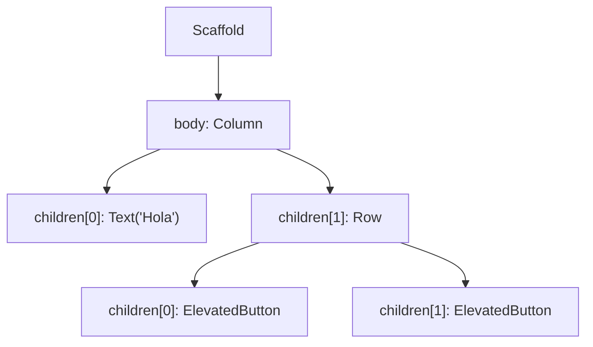
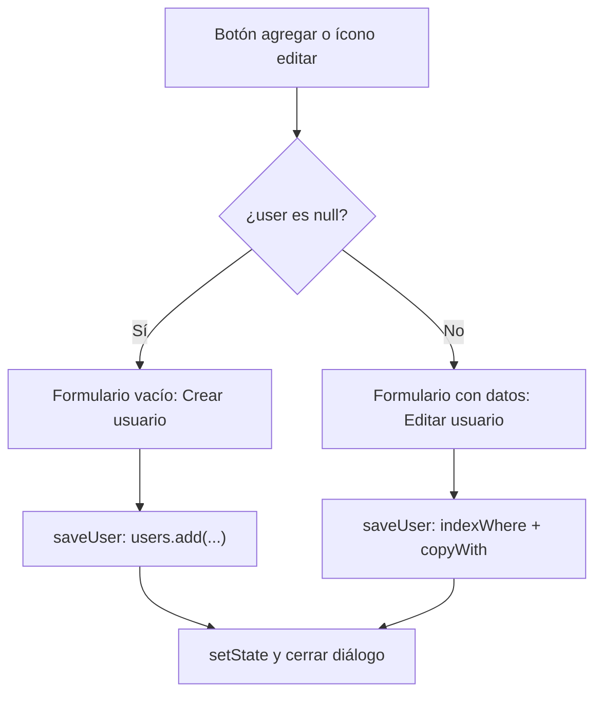

# Flutter — Biblioteca de Conceptos

Bootcamp de Desarrollo de Apps Móviles con Flutter — Código Facilito — Prof. Marines Méndez

> Este archivo se organiza por concepto, no cronológicamente. Para el orden real en que se dieron las clases, ver `../bitacora.md` y el historial de commits.
>
> Los fundamentos de desarrollo móvil (Android/iOS, pantallas, tipos de apps) están en [`../fundamentos/conceptos.md`](../fundamentos/conceptos.md); Dart como lenguaje está en el repo [`Curso-de-Dart`](https://github.com/DantheonHub/Curso-de-Dart). Este archivo asume ambos como base y se enfoca en Flutter como framework.
>
> Otras fuentes de esta sección: diapositivas oficiales de la cátedra ("Flutter básico" parte 1 y 2), el repositorio de ejemplos de la profesora, [Marines0210/bootcamp_flutter](https://github.com/Marines0210/bootcamp_flutter) y la documentación oficial de Flutter ([api.flutter.dev](https://api.flutter.dev)).

## Índice

- [Flutter — Biblioteca de Conceptos](#flutter--biblioteca-de-conceptos)
  - [Índice](#índice)
  - [1. ¿Qué es un widget, en serio?](#1-qué-es-un-widget-en-serio)
  - [2. El árbol de widgets: `child` y `children`](#2-el-árbol-de-widgets-child-y-children)
  - [3. `BuildContext`: el "dónde estoy parado" de un widget](#3-buildcontext-el-dónde-estoy-parado-de-un-widget)
  - [4. `Key`: identificar widgets entre sí](#4-key-identificar-widgets-entre-sí)
  - [5. `StatelessWidget` vs. `StatefulWidget`](#5-statelesswidget-vs-statefulwidget)
  - [6. `Scaffold` y `AppBar`: la anatomía de una pantalla](#6-scaffold-y-appbar-la-anatomía-de-una-pantalla)
  - [7. Material vs. Cupertino](#7-material-vs-cupertino)
  - [8. Layout: `Column`, `Row`, `Stack` y alineación](#8-layout-column-row-stack-y-alineación)
  - [9. Espaciado: `Padding` vs. `margin`](#9-espaciado-padding-vs-margin)
  - [10. Texto e íconos: `Text`, `RichText`, `Icon`](#10-texto-e-íconos-text-richtext-icon)
  - [11. `Image` y `BoxFit`](#11-image-y-boxfit)
  - [12. Botones](#12-botones)
  - [13. `CircleAvatar`](#13-circleavatar)
  - [14. `Card`](#14-card)
  - [15. `Container`](#15-container)
  - [16. Interactividad: `InkWell` vs. `GestureDetector`](#16-interactividad-inkwell-vs-gesturedetector)
  - [17. `ListTile`](#17-listtile)
  - [18. `SizedBox` y `Divider`](#18-sizedbox-y-divider)
  - [19. Menús: `Drawer` y `BottomNavigationBar`](#19-menús-drawer-y-bottomnavigationbar)
  - [20. Ventanas flotantes: `AlertDialog` y `showModalBottomSheet`](#20-ventanas-flotantes-alertdialog-y-showmodalbottomsheet)
  - [21. `TextEditingController` y atributos de `TextFormField`](#21-texteditingcontroller-y-atributos-de-textformfield)
  - [22. `Form`, `GlobalKey<FormState>` y validación](#22-form-globalkeyformstate-y-validación)
  - [23. `inputFormatters`: transformar y restringir lo que se escribe](#23-inputformatters-transformar-y-restringir-lo-que-se-escribe)
  - [24. Selección: `RadioListTile`, `CheckboxListTile`, `SwitchListTile`](#24-selección-radiolisttile-checkboxlisttile-switchlisttile)
  - [25. `DropdownButtonFormField`](#25-dropdownbuttonformfield)
  - [26. Formularios largos: `Stepper` y `AutofillGroup`](#26-formularios-largos-stepper-y-autofillgroup)
  - [27. `ListView`: listas con scroll](#27-listview-listas-con-scroll)
  - [28. Atributos de `ListView`](#28-atributos-de-listview)
  - [29. Listas horizontales y listas dentro de listas](#29-listas-horizontales-y-listas-dentro-de-listas)
  - [30. `GridView`: cuadrículas con scroll](#30-gridview-cuadrículas-con-scroll)
  - [31. Lista de objetos: agregar, editar y eliminar](#31-lista-de-objetos-agregar-editar-y-eliminar)

**Repaso rápido para el examen:** [21](#21-texteditingcontroller-y-atributos-de-textformfield) · [22](#22-form-globalkeyformstate-y-validación) · [28](#28-atributos-de-listview)

---

## 1. ¿Qué es un widget, en serio?

Ya se vio que Flutter no depende de un puente hacia lo nativo porque tiene su propio motor de renderizado (ver `fundamentos/conceptos.md`, punto 9). Eso es justamente lo que hace que **todo en Flutter sea un widget**: no solo los botones o los textos, sino también el espaciado, la alineación, la animación y hasta la propia pantalla. Flutter no distingue entre "componentes visuales" y "configuración de layout" como sí lo hacen otros frameworks — todo se expresa con el mismo bloque de construcción.

Un **widget** no es, en rigor, "el dibujo en pantalla" — es una **descripción** de cómo debería verse una porción de la interfaz en un momento dado. Es un objeto inmutable (no se modifica a sí mismo una vez creado) que Flutter usa como instrucción para dibujar. Cuando algo tiene que cambiar visualmente (un contador que aumenta, un texto que cambia de color), lo que en realidad pasa **no es que el widget existente se edite**, sino que Flutter descarta la descripción vieja y construye una nueva, comparando ambas para actualizar solo lo que realmente cambió en pantalla — sin redibujar toda la interfaz desde cero. Esto es lo que hace que Flutter sea rápido incluso con animaciones e interfaces complejas.

> 📌 No hace falta memorizar el mecanismo interno completo (que involucra conceptos más avanzados, como el *Element tree* y el *RenderObject tree*, por detrás de lo que uno programa). Lo importante para uso diario es esta idea: **un widget describe cómo se ve algo, no es la cosa en sí** — y por eso, para "cambiar" algo en pantalla, hay que decirle a Flutter que reconstruya esa descripción (ver `setState()` en la sección 5), no ir a buscar el elemento visual y editarlo directamente como se haría con el DOM en una página web.

## 2. El árbol de widgets: `child` y `children`

Como todo es un widget, y los widgets se anidan unos dentro de otros, la interfaz completa de una app termina siendo una **estructura en forma de árbol**: un widget raíz que contiene otros widgets, que a su vez pueden contener otros, y así sucesivamente.

Esa relación de "esto contiene a esto otro" se expresa con dos propiedades, que se diferencian **únicamente en la cantidad de elementos que aceptan**:

| Propiedad | Acepta | Se usa en widgets que... | Ejemplos comunes |
|---|---|---|---|
| `child` | Un único widget | Diseñan, limitan o modifican a un solo elemento | `Container`, `Center`, `Padding`, `SizedBox` |
| `children` | Una `List<Widget>` (lista) | Organizan una colección de elementos de forma ordenada | `Column`, `Row`, `ListView`, `Stack` |

```dart
// child: un solo widget
Center(
  child: Text('Hola Mundo'),
)

// children: una lista de widgets
Column(
  children: [
    Text('Primer elemento'),
    Text('Segundo elemento'),
  ],
)
```

Un ejemplo simple de árbol, con `Scaffold` como raíz visual de la pantalla:



Cada nodo de ese árbol es, en sí mismo, un widget completo — con sus propios atributos, y potencialmente sus propios hijos. `Column` no sabe ni le importa qué hay dentro de cada uno de sus `children`; solo los acomoda uno debajo del otro.

> ⚠️ Widgets como `Padding`, `Container` o `InkWell` solo aceptan **un** `child`. Si hace falta que el mismo padding (o el mismo `onTap`) afecte a *varios* elementos a la vez, la solución no es "forzar" varios hijos ahí — es envolver esos elementos primero en una `Column` o `Row` (que sí aceptan `children`), y pasar esa `Column`/`Row` como el único `child`. Es una consecuencia directa de que la estructura sea un árbol: si un nodo solo permite una rama, para meter más de una cosa hace falta un nodo intermedio que sí las agrupe.

## 3. `BuildContext`: el "dónde estoy parado" de un widget

El **contexto** (`BuildContext`, casi siempre nombrado como el parámetro `context`) es un identificador que indica la ubicación exacta de un widget dentro del árbol de componentes de la aplicación. No es un dato que uno arme a mano: Flutter se lo pasa automáticamente a cada widget cuando lo construye (aparece como parámetro del método `build(BuildContext context)`).

¿Para qué sirve saber "dónde estoy parado"? Porque muchas operaciones necesitan ubicarse en el árbol para funcionar:

- **Abrir un diálogo o un modal por encima de la pantalla actual** (`showDialog(context: context, ...)`, `showModalBottomSheet(context: context, ...)`) — Flutter necesita saber sobre qué parte del árbol dibujar esa ventana flotante.
- **Cerrar la pantalla, el modal o el menú actual** (`Navigator.pop(context)`) — necesita saber *cuál* pantalla/modal cerrar, y eso depende de dónde se está parado.
- Acceder a temas, tamaños de pantalla, o a un widget ancestro (`Theme.of(context)`, `MediaQuery.of(context)`) — todos estos "buscan hacia arriba" en el árbol a partir del `context` que se les da.

Esto también explica algo importante: **un widget no se puede "llamar" directamente desde `main()`**. Flutter arma la interfaz recorriendo el árbol desde la raíz (`runApp()` hacia abajo); solo lo que está efectivamente ubicado dentro de esa jerarquía (por ejemplo, colocado en el `body` de un `Scaffold`, que a su vez está dentro de la app) tiene un `context` válido y es "visible" para el sistema. Crear un widget nuevo por separado, sin insertarlo en algún punto del árbol ya existente, no hace que aparezca en pantalla — hay que mandarlo a llamar desde un lugar del árbol que sí se esté construyendo.

## 4. `Key`: identificar widgets entre sí

Las **`Key`** son identificadores que le permiten al motor de Flutter distinguir un widget de otro cuando el árbol de la interfaz cambia — por ejemplo, cuando se reordenan, agregan o eliminan elementos de una lista dinámica. Sin una `Key`, Flutter identifica a los widgets por su posición y tipo dentro del árbol; si esa posición cambia (se inserta un elemento al principio de una lista, por ejemplo), Flutter puede "confundirse" y reutilizar el estado de un widget para otro que en realidad es distinto.

| Tipo de `Key` | Qué usa como identificador |
|---|---|
| `ValueKey` | Un valor simple ya existente, como un ID o un texto |
| `UniqueKey` | Un identificador completamente único y aleatorio, generado por Flutter |
| `GlobalKey` | Permite además **acceder al estado** de ese widget puntual desde cualquier otra parte de la aplicación |

> 📌 No hace falta usar `Key` en cada widget que se cree — es una herramienta puntual para cuando el árbol cambia dinámicamente (listas que se reordenan, elementos que aparecen/desaparecen) y Flutter necesita ayuda extra para no perder el rastro de cuál widget es cuál. Se retoma con más detalle al trabajar con listas dinámicas.

## 5. `StatelessWidget` vs. `StatefulWidget`

Flutter separa los widgets en dos grandes familias, según si necesitan **recordar y actualizar información propia** o no.

| | `StatelessWidget` | `StatefulWidget` |
|---|---|---|
| ¿Guarda datos que cambian con el tiempo? | No | Sí |
| ¿Se puede "redibujar a sí mismo" tras crearse? | No — solo cambia si su *padre* lo reconstruye con datos nuevos | Sí, con `setState()` |
| Ejemplos típicos | Un texto fijo, un ícono, una tarjeta de producto estática | Un contador, un formulario, un botón que cambia de estado |

**¿Por qué existe esta separación?** Por eficiencia: si Flutter tuviera que revisar *todos* los widgets de la app constantemente por si alguno cambió, sería carísimo en rendimiento. Al declarar explícitamente cuáles widgets pueden cambiar (`StatefulWidget`) y cuáles no (`StatelessWidget`), Flutter sabe de antemano qué partes del árbol necesita vigilar y cuáles puede dar por sentado que no van a cambiar solas.

**Ejemplo de `StatelessWidget`** — un texto enriquecido que nunca cambia una vez construido:

```dart
class RegisterText extends StatelessWidget {
  @override
  Widget build(BuildContext context) {
    return RichText(
      text: const TextSpan(
        text: '¿No tienes cuenta? ',
        style: TextStyle(color: Colors.black),
        children: <TextSpan>[
          TextSpan(
            text: 'Registrarme',
            style: TextStyle(fontWeight: FontWeight.bold),
          ),
        ],
      ),
    );
  }
}
```

**Ejemplo de `StatefulWidget`** — un botón que alterna entre dos estados ("Guardar" / "Editar") al tocarlo:

```dart
class SaveButton extends StatefulWidget {
  @override
  State<StatefulWidget> createState() => SaveButtonState();
}

class SaveButtonState extends State<SaveButton> {
  bool isSave = false;

  @override
  Widget build(BuildContext context) {
    return TextButton.icon(
      icon: Icon(isSave ? Icons.edit : Icons.save),
      label: Text(isSave ? "Editar" : "Guardar"),
      style: TextButton.styleFrom(
        foregroundColor: Colors.green,
        iconColor: Colors.green,
      ),
      onPressed: () {
        setState(() {
          isSave = !isSave;
        });
      },
    );
  }
}
```

Un `StatefulWidget` en realidad son **dos clases trabajando juntas**:

- La clase que extiende `StatefulWidget` (`SaveButton`) es, en los hechos, solo una fábrica: su único trabajo es crear el objeto `State` correspondiente (`createState()`).
- La clase que extiende `State<T>` (`SaveButtonState`) es donde realmente vive tanto el **estado** (las variables que pueden cambiar, como `isSave`) como el método `build()` que arma la interfaz a partir de ese estado.

**`setState()`** es el mecanismo para avisarle a Flutter "esto cambió, volvé a construir la interfaz": se llama dentro de la clase `State`, envolviendo la actualización de la variable (como en el ejemplo, `isSave = !isSave;` dentro de `setState()`). Sin el `setState()`, la variable cambiaría igual en memoria, pero Flutter **no se enteraría** de que tiene que redibujar nada — la pantalla se quedaría mostrando el valor viejo hasta que algo más disparara una reconstrucción.

> 📌 **Gestión de estado avanzada.** El patrón de `setState()` funciona bien para estado que le pertenece a un solo widget. Cuando la app crece y varias pantallas necesitan compartir y sincronizar los mismos datos (por ejemplo, el usuario logueado, o el contenido de un carrito de compras), se usan herramientas externas de manejo de estado como **Provider**, **BLoC** o **Riverpod** — temas que se retoman en el módulo de "Estructura y Manejo del Estado" del cronograma.

## 6. `Scaffold` y `AppBar`: la anatomía de una pantalla

`Scaffold` es el widget base que da la estructura típica de una pantalla de Material Design, con "espacios" predefinidos para las partes más comunes de una interfaz:

```dart
Scaffold(
  backgroundColor: Colors.grey[100],
  appBar: AppBar(
    title: Text("Home Page"),
  ),
  body: Center(
    child: Column(
      mainAxisAlignment: MainAxisAlignment.center,
      children: <Widget>[
        Text('You have pushed the button this many times:'),
        Text('0'),
      ],
    ),
  ),
  floatingActionButton: FloatingActionButton(
    onPressed: () {},
    child: Icon(Icons.add),
  ),
)
```

| Parámetro de `Scaffold` | Qué representa |
|---|---|
| `appBar` | La barra superior |
| `body` | El contenido principal de la pantalla |
| `floatingActionButton` | El botón circular flotante, típico de Material Design |
| `backgroundColor` | Color de fondo de toda la pantalla |
| `drawer` | El menú lateral (ver sección 19) |
| `bottomNavigationBar` | La barra de navegación inferior (ver sección 19) |

**`AppBar`** tiene, a su vez, sus propias propiedades:

| Propiedad | Descripción |
|---|---|
| `title` | Widget con el título o descripción del contenido actual de la pantalla (se puede personalizar con cualquier widget, no solo texto) |
| `key` | Opcional; identifica este widget puntual (ver sección 4) |
| `centerTitle` | Booleano; si es `true`, centra el `title` en la barra |
| `elevation` | Sombra debajo de la barra; debe ser mayor que 0 para que se note |
| `backgroundColor` | Color de relleno de la barra. Combinado con `Colors.transparent` y `elevation: 0` se logra una barra transparente |
| `toolbarHeight` | Altura personalizada de la barra (por ejemplo, 70, 80 o 100) |
| `actions` | Lista de widgets alineados a la derecha, después del `title` (íconos de búsqueda, notificaciones, menú de opciones, etc.) |
| `leading` | Widget mostrado *antes* del `title` — normalmente un ícono o botón (por ejemplo, el ícono del `Drawer`, que aparece automáticamente si el `Scaffold` tiene uno) |
| `bottom` | Widget ubicado en la parte inferior de la `AppBar` — típicamente una `TabBar` |

> 📌 **"Page", la nomenclatura correcta.** El propio framework de Flutter (su documentación, sus mensajes de error, widgets como `PageView`) llama **"page"** a una pantalla completa — es la nomenclatura oficial, y la que se va a seguir en este bootcamp (`home_page.dart`, `menu_page.dart`). No conviene adoptar "screen" como costumbre solo porque aparece seguido en tutoriales o proyectos de terceros: alinearse con el término que usa el propio framework evita inconsistencias más adelante, sobre todo al leer la documentación oficial o el código fuente de Flutter.

## 7. Material vs. Cupertino

Flutter ofrece dos bibliotecas de widgets con el mismo propósito (botones, interruptores, barras de navegación, etc.) pero con la apariencia de cada plataforma:

- **Material** (`package:flutter/material.dart`): sigue el lenguaje de diseño de Google, Material Design, adaptado para Android — es el que se usa por defecto en este bootcamp.
- **Cupertino** (`package:flutter/cupertino.dart`): imita el estilo clásico de Apple para iOS.

Además, Flutter permite una **personalización total**: se pueden crear diseños propios combinando widgets básicos, sin depender de los componentes nativos del teléfono en absoluto. Esto le permite a una misma base de código Flutter mostrarse "como una app nativa" tanto en Android como en iOS, si así se lo requiere — aunque en la práctica muchas apps multiplataforma usan Material en ambos sistemas para simplificar el diseño.

## 8. Layout: `Column`, `Row`, `Stack` y alineación

`Column` acomoda sus `children` uno debajo del otro (verticalmente); `Row` los acomoda uno al lado del otro (horizontalmente). Ambos comparten los mismos atributos de alineación, pero su significado depende de la dirección del widget:

- **Eje principal (*main axis*):** la dirección en la que el widget "fluye" — vertical en `Column`, horizontal en `Row`.
- **Eje transversal (*cross axis*):** la dirección perpendicular a esa — horizontal en `Column`, vertical en `Row`.

| Atributo | Controla alineación en el eje... |
|---|---|
| `mainAxisAlignment` | Principal |
| `crossAxisAlignment` | Transversal |
| `mainAxisSize` | Si el widget ocupa todo el espacio disponible en su eje principal (`.max`, por defecto) o solo lo que necesita su contenido (`.min`) |

Valores más usados para `mainAxisAlignment`/`crossAxisAlignment`:

| Valor | Efecto |
|---|---|
| `.start` | Agrupa todo al principio del eje (arriba, o a la izquierda) |
| `.end` | Agrupa todo al final del eje (abajo, o a la derecha) |
| `.center` | Centra todo en el eje |
| `.spaceBetween` | Reparte el espacio sobrante *entre* los elementos, sin dejar margen en los extremos |
| `.spaceAround` | Reparte el espacio sobrante alrededor de cada elemento (incluidos los extremos, con la mitad de espacio ahí) |
| `.spaceEvenly` | Reparte el espacio sobrante de manera exactamente pareja, incluidos los extremos |

```dart
Row(
  mainAxisAlignment: MainAxisAlignment.spaceAround,
  crossAxisAlignment: CrossAxisAlignment.center,
  mainAxisSize: MainAxisSize.min,
  children: [
    Icon(Icons.favorite),
    Icon(Icons.music_note),
  ],
)
```

**`Stack`** es un widget de layout distinto a los otros dos: en vez de acomodar a sus `children` uno al lado del otro o uno debajo del otro, los **superpone**, dibujándolos unos encima de otros en el mismo espacio (el primero de la lista queda más al fondo, el último más arriba). Sirve, por ejemplo, para poner una etiqueta o un ícono sobre una imagen. Se profundiza más adelante, cuando haga falta para diseños específicos — por ahora alcanza con saber que existe y cuál es su diferencia clave con `Column`/`Row`.

## 9. Espaciado: `Padding` vs. `margin`

Son dos formas de generar espacio, pero en lugares distintos respecto del "borde" de un widget:

- **`Padding`** (como widget, o como atributo `padding` de `Container`): espacio **interno** — empuja el contenido hacia adentro, alejándolo de los bordes del propio widget.
- **`margin`** (atributo de `Container`): espacio **externo** — aleja al widget completo de lo que lo rodea, por fuera de su propio borde.

```dart
Padding(
  padding: EdgeInsets.all(10),
  child: Text("Hola"),
)
```

`EdgeInsets` tiene variantes para especificar el espaciado en direcciones puntuales, en vez de aplicar el mismo valor en las cuatro:

| Constructor | Direcciones que afecta |
|---|---|
| `EdgeInsets.all(valor)` | Las cuatro direcciones por igual |
| `EdgeInsets.symmetric(horizontal: ..., vertical: ...)` | Izquierda+derecha con un valor, arriba+abajo con otro |
| `EdgeInsets.only(top: ..., bottom: ..., left: ..., right: ...)` | Cada dirección por separado, solo las que se indiquen |

## 10. Texto e íconos: `Text`, `RichText`, `Icon`

**`Text`** muestra una cadena de texto simple, con estilo controlado por `TextStyle` (color, tamaño, negrita, etc.):

```dart
Text(
  "Hola mundo",
  style: TextStyle(
    color: Colors.blue,
    fontSize: 25,
    fontWeight: FontWeight.bold,
  ),
)
```

**`RichText`** resuelve un caso que `Text` no puede: un mismo bloque de texto donde **distintas partes necesitan estilos distintos** (por ejemplo, una frase con una palabra en negrita en el medio). En vez de armar varios `Text` widgets separados, `RichText` recibe un único `TextSpan`, que a su vez puede tener `children` con más `TextSpan` anidados, cada uno con su propio estilo:

```dart
RichText(
  text: TextSpan(
    text: '¿No tienes cuenta? ',
    style: TextStyle(color: Colors.black),
    children: const <TextSpan>[
      TextSpan(
        text: 'Registrarme',
        style: TextStyle(fontWeight: FontWeight.bold),
      ),
    ],
  ),
)
```

**`Icon`** muestra un ícono de una de las fuentes de íconos incluidas en Flutter (`Icons.*`), con color y tamaño configurables:

```dart
Icon(
  Icons.favorite,
  color: Colors.pinkAccent,
  size: 40,
)
```

> 📌 **`TextFormField`** es el widget de Flutter para campos de entrada de texto editables por el usuario (formularios de login, registro, búsqueda, etc.). Se menciona acá porque aparece listado junto al resto de los widgets básicos, pero su uso completo (validación, controladores de texto, tipos de teclado) se retoma en el módulo de "Listas y formularios" del cronograma, cuando se trabaje específicamente con formularios.

## 11. `Image` y `BoxFit`

```dart
Image.network(
  "https://codigofacilito.com/avatar.jpg",
  height: 100,
  width: 100,
  fit: BoxFit.cover,
)
```

Cuando el tamaño de la imagen original no coincide exactamente con el espacio (`height`/`width`) asignado, `fit` (de tipo `BoxFit`) define cómo se **adapta** la imagen a ese espacio:

| Valor de `BoxFit` | Comportamiento |
|---|---|
| `none` | No escala la imagen; la muestra en su tamaño original, recortando lo que no entre |
| `scaleDown` | Como `none`, pero puede *achicar* la imagen si es más grande que el espacio (nunca la agranda) |
| `fitWidth` | Escala la imagen para que ocupe todo el ancho disponible, aunque se recorte verticalmente |
| `fitHeight` | Escala la imagen para que ocupe todo el alto disponible, aunque se recorte horizontalmente |
| `fill` | Estira la imagen para llenar exactamente el espacio, sin respetar su proporción original (puede deformarla) |
| `contain` | Escala la imagen para que entre completa dentro del espacio, respetando su proporción (puede dejar espacio vacío) |
| `cover` | Escala la imagen para cubrir *todo* el espacio, respetando su proporción (puede recortar los bordes que sobren) — el más usado para fotos de portada o fondo |

## 12. Botones

Flutter distingue varios tipos de botón según qué tan "importante" visualmente debe verse la acción:

| Widget | Apariencia | Cuándo usarlo |
|---|---|---|
| `TextButton` | Plano, sin fondo ni borde | Acciones secundarias, poco prioritarias |
| `OutlinedButton` | Con borde, sin relleno | Acciones intermedias — visibles pero no la acción principal |
| `ElevatedButton` | Con relleno de color y sombra (elevado) | La acción principal de la pantalla |
| `IconButton` / `TextButton.icon` / `ElevatedButton.icon` | Variante con ícono | Cuando conviene reforzar la acción con un ícono además del texto |

```dart
TextButton(
  child: const Text('Guardar'),
  style: TextButton.styleFrom(
    foregroundColor: Colors.green,
  ),
  onPressed: () {},
)

OutlinedButton(
  child: const Text('Guardar'),
  style: OutlinedButton.styleFrom(
    foregroundColor: Colors.green,
    side: BorderSide(width: 1.0, color: Colors.green),
  ),
  onPressed: () {},
)

TextButton.icon(
  icon: Icon(Icons.save),
  label: Text("Guardar"),
  style: TextButton.styleFrom(
    foregroundColor: Colors.green,
    iconColor: Colors.black,
  ),
  onPressed: () {},
)

ElevatedButton(
  child: const Text('Guardar'),
  style: ElevatedButton.styleFrom(
    backgroundColor: Colors.green,
    foregroundColor: Colors.black,
  ),
  onPressed: () {},
)
```

`styleFrom(...)` es el método común a todos los tipos de botón para personalizar su apariencia (color de fondo, color de texto/ícono, bordes) sin tener que armar un `ButtonStyle` completo a mano.

## 13. `CircleAvatar`

Widget pensado específicamente para mostrar una imagen de perfil circular:

```dart
CircleAvatar(
  radius: 48,
  backgroundImage: NetworkImage("https://codigofacilito.com/avatar.jpg"),
)
```

`backgroundImage` recibe un `ImageProvider` (`NetworkImage`, `AssetImage`) — la misma idea de "proveedor de imagen, no widget" que se usa en `DecorationImage` (ver sección 15).

## 14. `Card`

`Card` es un contenedor pensado para mostrar contenido "destacado". Sus características principales:

- **Elevación:** muestra una sombra que da la sensación de estar flotando sobre el fondo.
- **Versatilidad:** puede contener cualquier tipo de widget en su interior — textos, imágenes, columnas, botones.
- **Organización:** ayuda a separar visualmente la información para que la interfaz sea más limpia y clara.

Comparado con `Container` (sección 15), `Card` es **más limitado a propósito**: no tiene atributos de ancho/alto explícitos — se adapta automáticamente al tamaño de lo que tenga adentro (`child`). Lo que sí ofrece es una forma simple de lograr elevación y bordes redondeados sin tener que armarlos a mano.

```dart
Card(
  elevation: 4,
  shape: RoundedRectangleBorder(
    borderRadius: BorderRadius.circular(12),
    side: BorderSide(color: Colors.blue, width: 2),
  ),
  child: Padding(
    padding: EdgeInsets.all(16),
    child: Column(
      crossAxisAlignment: CrossAxisAlignment.start,
      children: [
        Image.network("https://...", fit: BoxFit.cover),
        Text("Título", style: TextStyle(fontSize: 30, fontWeight: FontWeight.bold)),
        Text("Descripción"),
        Row(
          mainAxisAlignment: MainAxisAlignment.end,
          children: [
            TextButton(onPressed: () {}, child: Text("Compartir")),
            TextButton(onPressed: () {}, child: Text("Explorar")),
          ],
        ),
      ],
    ),
  ),
)
```

Notar el patrón visto en la sección 2: como `Card` y `Padding` solo aceptan un `child`, todo el contenido (imagen, título, descripción, botones) se agrupa primero en una `Column`, y esa `Column` es el único hijo que ambos reciben.

- `shape: RoundedRectangleBorder(...)` permite personalizar el borde: `borderRadius` para las esquinas redondeadas, y `side: BorderSide(color: ..., width: ...)` para el color y grosor del borde.
- `mainAxisAlignment: MainAxisAlignment.end` en la fila de botones los agrupa hacia la derecha; `.spaceBetween` los separaría uno de cada extremo.

## 15. `Container`

`Container` es, en esencia, un widget "todo terreno" para layout y decoración: a diferencia de `Card`, sí permite especificar explícitamente `width`, `height`, `margin`, `padding`, `alignment`, y una **decoración** completa (`decoration`).

```dart
Container(
  width: 200,
  height: 200,
  padding: EdgeInsets.all(16),
  alignment: Alignment.center,
  decoration: BoxDecoration(
    color: Colors.blue, // OJO: no puede coexistir con Container(color: ...) directo
  ),
  child: Text("Hola mundo"),
)
```

> ⚠️ `Container` tiene su propio atributo `color`, pero **no se puede usar al mismo tiempo** que `color` dentro de `decoration: BoxDecoration(...)` — Flutter tira error, porque son dos formas de definir lo mismo y no sabe cuál priorizar. Regla práctica: si se necesita `decoration` para cualquier otra cosa (bordes, degradado, imagen de fondo), el color también tiene que ir *adentro* de esa `BoxDecoration`, no como atributo directo del `Container`.

**`BoxDecoration`** es donde vive casi toda la personalización visual de un `Container`:

- **`shape`**: forma general (`BoxShape.rectangle` por defecto, o `BoxShape.circle`).
- **`borderRadius`**: esquinas redondeadas.
  - `BorderRadius.circular(20)` redondea las **cuatro** esquinas por igual.
  - `BorderRadius.only(topLeft: Radius.circular(50), topRight: Radius.circular(50))` redondea **solo** las esquinas indicadas — el resto quedan en ángulo recto. Es la técnica para lograr, por ejemplo, una forma de "burbuja de chat" (esquinas superiores redondeadas, inferiores en ángulo recto).
- **`gradient`**: degradado de colores, en vez de un color sólido.

```dart
decoration: BoxDecoration(
  gradient: LinearGradient(
    colors: [Colors.blue, Colors.purple],
    begin: Alignment.topLeft,
    end: Alignment.bottomRight,
  ),
),
```
`colors` es la lista de colores del degradado (en orden); `begin` y `end` son dos puntos (`Alignment`) que definen la dirección en la que se recorre ese degradado — de arriba-izquierda a abajo-derecha, en este ejemplo, genera una diagonal.

- **`image`**: imagen de fondo, con `DecorationImage`:

```dart
decoration: BoxDecoration(
  image: DecorationImage(
    image: AssetImage("assets/fondo.png"),
    fit: BoxFit.cover,
  ),
),
```

> 📌 **`Image` (widget) vs. `AssetImage`/`NetworkImage` (proveedores de imagen).** `Image.asset(...)` o `Image.network(...)` son **widgets completos**: ocupan un lugar en el árbol y se pueden usar como `child` de cualquier cosa, tal como se ve en el ejemplo del `Card` de la sección 14. `AssetImage(...)` y `NetworkImage(...)`, en cambio, **no son widgets** — son solo una referencia a *dónde* está la imagen (un `ImageProvider`), pensada para pasarse como parámetro a otras cosas que sí saben qué hacer con esa imagen, como `DecorationImage` (dentro de `BoxDecoration`) o `CircleAvatar` (sección 13). La diferencia importa porque son intercambiables solo en el contexto correcto: no se puede poner un `AssetImage` directamente como `child` de un `Container`, porque no es un widget.

Un container también puede combinar varias de estas técnicas a la vez — por ejemplo, un contenedor con degradado de fondo, sombra, y bordes redondeados solo arriba, conteniendo internamente otro `Container` con esquinas redondeadas invertidas, un `Divider`, y una lista de `ListTile` — el mismo patrón de "widgets simples combinados" que se usa para diseños más elaborados de catálogo o chat.

## 16. Interactividad: `InkWell` vs. `GestureDetector`

Ambos son widgets "invisibles" que envuelven a otro widget para hacerlo interactivo — la diferencia está en qué tan simple o completo es el conjunto de gestos que reconocen, y si dan una respuesta visual automática.

| | `InkWell` | `GestureDetector` |
|---|---|---|
| Propósito | Crear áreas interactivas bajo las guías de Material Design | Detectar una gran variedad de gestos táctiles complejos |
| Gestos que reconoce | Toque simple (`onTap`), pulsación larga (`onLongPress`) | Toques, doble toque, pulsación larga, arrastrar (*drag*), zoom (*scale*), deslizamiento (*swipe*) |
| Respuesta visual | Automática — efecto de onda (*ripple*) de Material al tocar | Ninguna por defecto — hay que armarla manualmente si se quiere |
| Cuándo usarlo | Botones, tarjetas (`Card`) o elementos de lista donde el usuario espera la respuesta visual inmediata típica de Material Design | Áreas interactivas personalizadas, imágenes, o gestos avanzados donde no se necesita (o no se quiere) el diseño Material |

```dart
InkWell(
  onTap: () {
    print("Se hizo click");
  },
  onLongPress: () {
    print("Se mantuvo presionado");
  },
  child: Card(/* ... */),
)
```

En la práctica: para el caso más común (un `Card` o `Container` que se pueda tocar, con la sensación visual esperable de Material Design), `InkWell` alcanza y sobra. `GestureDetector` queda para más adelante, cuando haga falta reconocer gestos que `InkWell` no cubre (arrastrar, hacer zoom, deslizar).

## 17. `ListTile`

Un `ListTile` es un widget prediseñado que representa una fila fija con un formato estándar de Material Design, ideal para mostrar elementos dentro de una lista — sin necesidad de armar el layout a mano con `Row`/`Column`:

```dart
ListTile(
  leading: Icon(Icons.message),
  title: Text("Item 3"),
  subtitle: Text("Slide left or right"),
  trailing: Icon(Icons.arrow_back),
)
```

| Parámetro | Ubicación |
|---|---|
| `leading` | Widget a la izquierda (típicamente un ícono) |
| `title` | Texto principal |
| `subtitle` | Texto secundario, debajo del título |
| `trailing` | Widget a la derecha (típicamente un ícono de flecha, indicando que lleva a otra pantalla) |

Es el patrón habitual en menús y listas de navegación: un ícono identificando la opción a la izquierda, el texto en el medio, y una flecha a la derecha sugiriendo que tocar esa fila abre algo más.

> 📌 El mismo resultado visual de un `ListTile` simple se podría armar a mano combinando un `Row` con un `Icon`, una `Column` de dos `Text` (título y subtítulo), y otro `Icon` al final — pero `ListTile` ya resuelve el espaciado y la alineación correctos por defecto, evitando repetir ese layout manualmente cada vez.

> ⚠️ `title` y `subtitle` de un `ListTile` quedan siempre alineados a la izquierda — no admiten `Alignment.center` ni un `mainAxisAlignment` propio, porque el widget no expone esos parámetros. Para centrar (o alinear de otra forma) el contenido de una fila estilo `ListTile`, hay que reconstruirla a mano con `Row` + `Column`, usando `crossAxisAlignment`/`mainAxisAlignment` como en cualquier layout propio.

## 18. `SizedBox` y `Divider`

- **`SizedBox`**: widget "vacío" cuyo único propósito es imponerle un ancho y/o alto explícitos a su `child` — o, sin `child`, actuar como un espacio en blanco de tamaño fijo entre dos widgets (por ejemplo, `SizedBox(height: 16)` entre dos elementos de una `Column`, a modo de separador sin necesidad de márgenes).
- **`Divider`**: una línea horizontal simple, usada para separar visualmente elementos de una lista. Se puede personalizar color y grosor:

```dart
Divider(color: Colors.black, thickness: 2)
```

## 19. Menús: `Drawer` y `BottomNavigationBar`

Son componentes de interfaz usados para navegar entre las secciones principales de una aplicación móvil — dos formas distintas de resolver lo mismo, con ubicaciones y comportamientos distintos.

**`Drawer`** es un menú lateral que se desliza desde el borde de la pantalla. Se asigna directamente al atributo `drawer` del `Scaffold`; al hacerlo, Flutter agrega **automáticamente** el ícono de "hamburguesa" en el `AppBar` para abrirlo (no hace falta programarlo a mano).

```dart
Scaffold(
  appBar: AppBar(title: Text("Inicio")),
  drawer: Drawer(
    child: ListView(
      children: [
        UserAccountsDrawerHeader(
          accountName: Text("Marines"),
          accountEmail: Text("marines@codigofacilito.com"),
          currentAccountPicture: CircleAvatar(child: Icon(Icons.person)),
        ),
        ListTile(leading: Icon(Icons.home), title: Text("Inicio"), onTap: () {}),
        ListTile(leading: Icon(Icons.person), title: Text("Perfil"), onTap: () {}),
        ListTile(leading: Icon(Icons.settings), title: Text("Ajustes"), onTap: () {}),
      ],
    ),
  ),
  body: /* contenido según la opción seleccionada */,
)
```

`UserAccountsDrawerHeader` es un widget de Flutter ya armado específicamente para la cabecera típica de un `Drawer` (nombre, correo y avatar), sin tener que diseñarla desde cero.

**`BottomNavigationBar`** cumple el mismo rol de navegación, pero como una barra fija en la parte inferior de la pantalla:

```dart
BottomNavigationBar(
  currentIndex: _index,
  onTap: (nuevoIndex) {
    setState(() {
      _index = nuevoIndex;
    });
  },
  items: [
    BottomNavigationBarItem(icon: Icon(Icons.home), label: "Inicio"),
    BottomNavigationBarItem(icon: Icon(Icons.person), label: "Perfil"),
  ],
)
```

> ⚠️ `BottomNavigationBar` exige **como mínimo dos** `items` — con uno solo, Flutter tira error (no tendría sentido una barra de navegación con una sola opción).

**El patrón común a ambos** (y, en general, a cualquier navegación por índice): se guarda un `int` como estado (por ejemplo `_index`), que representa qué sección está activa. Cada `onTap` actualiza ese índice dentro de un `setState()`, y ese mismo índice se usa para decidir qué mostrar en el `body` — típicamente indexando una lista de widgets ya armados (`paginas[_index]`), o con un `switch`.

`currentIndex` en `BottomNavigationBar` es lo que hace que la opción activa quede visualmente resaltada — sin ese atributo sincronizado con el estado, la barra no "recordaría" cuál sección está mostrándose.

> ⚠️ **`Navigator.pop(context)`** cierra la pantalla, el menú o el modal que esté abierto actualmente por encima de todo lo demás — por ejemplo, para cerrar el `Drawer` después de seleccionar una opción (si no, el menú se queda abierto tras el click). Si se llama `pop()` estando en la pantalla principal, sin ningún `Drawer`/modal abierto encima, lo que se cierra es **la aplicación completa**, porque no hay nada "por encima" para cerrar. Esto se retoma con más cuidado cuando se vea navegación entre pantallas (rutas) más adelante.
>
> Por diseño, no se recomienda usar `Drawer` y `BottomNavigationBar` al mismo tiempo en una app real — sirven para lo mismo, y combinarlos suele saturar al usuario con demasiadas formas de navegar. Se usan juntos en los ejemplos de clase solo a modo de comparación.

## 20. Ventanas flotantes: `AlertDialog` y `showModalBottomSheet`

Son componentes visuales de Flutter que muestran información en primer plano sobre la pantalla actual, sin navegar a una pantalla nueva — pero pensados para objetivos y lugares diferentes.

**`AlertDialog`** (mostrado con `showDialog`) es una ventana emergente que aparece centrada sobre la pantalla, pensada para pedir confirmación o una decisión importante del usuario antes de continuar:

```dart
showDialog(
  context: context,
  builder: (context) => AlertDialog(
    title: Text("Eliminar elemento"),
    content: Text("¿Estás seguro de que deseas eliminar este registro?"),
    actions: [
      TextButton(
        onPressed: () => Navigator.pop(context),
        child: Text("Cancelar"),
      ),
      TextButton(
        onPressed: () {
          // acción de eliminar
          Navigator.pop(context);
        },
        child: Text("Eliminar"),
      ),
    ],
  ),
);
```

- **`title`**: explica el motivo de la alerta (ej. "¿Deseas salir?").
- **`content`**: muestra detalles o un texto descriptivo.
- **`actions`**: botones como "Cancelar" o "Aceptar" para que el usuario responda.
- **Cierre (`Navigator.pop`)**: sirve para cerrar la ventana cuando el usuario toca un botón — sin esto, el diálogo se quedaría abierto para siempre.

**`showModalBottomSheet`**: una ventana que se desliza desde abajo, ocupando parte de la pantalla — típica para mostrar opciones adicionales o contenido secundario sin abandonar la vista actual.

```dart
showModalBottomSheet(
  context: context,
  builder: (context) => SizedBox(
    height: 200,
    child: Center(
      child: Column(
        mainAxisAlignment: MainAxisAlignment.center,
        children: [
          Text("Este es un modal"),
          TextButton(
            onPressed: () => Navigator.pop(context),
            child: Text("Cerrar"),
          ),
        ],
      ),
    ),
  ),
);
```

Se puede cerrar tocando fuera de él o con el gesto de retroceso, pero conviene siempre agregar un botón explícito de cerrar — muchos usuarios no dan por sentado que se puede descartar tocando afuera, y un botón visible deja claro que la ventana se puede cerrar.

## 21. `TextEditingController` y atributos de `TextFormField`

Para leer o fijar el texto de una caja desde código (no solo mostrarlo) se usa un **`TextEditingController`**: se declara, se inicializa, y se lo asigna al atributo `controller` del `TextFormField`. A partir de ahí, `controller.text` da acceso en cualquier momento al valor actual escrito por el usuario.

```dart
final _nombreController = TextEditingController();

TextFormField(
  controller: _nombreController,
)

// en cualquier otro punto del código, por ejemplo al presionar un botón:
print(_nombreController.text);
```

> ⚠️ `controller` e `initialValue` no se pueden usar juntos en el mismo `TextFormField` — Flutter tira error. Si se necesita un texto inicial **y** poder leerlo/modificarlo después desde código, la única vía es el `controller`, inicializándolo con ese valor: `TextEditingController(text: "valor inicial")`. `initialValue` solo sirve para el caso más simple, donde alcanza con fijar un texto de partida sin necesidad de acceder a él por código.

`TextFormField` tiene, además de `controller`, un conjunto amplio de atributos para controlar tanto su apariencia como el comportamiento del teclado:

| Atributo | Qué hace |
|---|---|
| `decoration` | Recibe un `InputDecoration` — controla toda la apariencia del campo (detalle abajo) |
| `style` | `TextStyle` aplicado al texto que el usuario escribe (color, tamaño, negrita) — distinto de la `decoration`, que estiliza el campo alrededor del texto (etiqueta, bordes, fondo), no el texto en sí |
| `keyboardType` | Qué teclado se muestra: `TextInputType.text` (normal), `.number`, `.emailAddress`, `.phone`, entre otros |
| `textInputAction` | Qué acción ofrece el botón de "enter"/acción del teclado: `.done`, `.next`, `.search`, etc. |
| `autofocus` | Si `true`, el campo recibe el foco (y el teclado se abre) automáticamente al construirse la pantalla, sin que el usuario tenga que tocarlo primero |
| `onFieldSubmitted` | Se ejecuta cuando el usuario presiona ese botón de acción del teclado — permite reaccionar al "enviar" sin necesidad de un botón aparte en pantalla (el mismo patrón que usa WhatsApp: escribir el mensaje y mandarlo con el botón de "enter" del teclado, en vez de tocar un ícono en la interfaz) |
| `obscureText` | Oculta visualmente el texto ingresado (campos de contraseña) |
| `enabled` | Habilita o deshabilita la edición del campo — con `false`, el campo se puede seguir mostrando (útil para pantallas de "solo ver mis datos") pero no se puede tocar, escribir ni aparece el teclado |
| `maxLength` | Límite de caracteres permitidos |
| `maxLines` | Cantidad de líneas visibles del campo |
| `onChanged` | Se ejecuta en cada tecleo, devolviendo el texto tal como está en ese instante — útil para reflejar en pantalla, en tiempo real, lo que el usuario va escribiendo (requiere `setState()` para que ese reflejo se vea, como cualquier otra actualización de estado) |
| `validator` | Función de validación (sección 22) |
| `inputFormatters` | Lista de transformaciones/restricciones sobre lo que se ingresa (sección 23) |

`decoration` es, en la práctica, el atributo con más superficie: recibe un `InputDecoration` con sus propios sub-atributos.

| Sub-atributo de `InputDecoration` | Qué hace |
|---|---|
| `labelText` | Etiqueta del campo — típicamente se ve dentro de la caja y se achica arriba del borde al enfocar o al escribir |
| `hintText` | Texto de ayuda/pista, visible solo mientras el campo está vacío (desaparece al escribir, a diferencia del `labelText`) |
| `icon` | Ícono mostrado afuera del campo, antes del borde |
| `prefixIcon` | Ícono mostrado adentro del campo, al principio (ej. un ícono de sobre en un campo de email) |
| `suffixIcon` | Ícono mostrado adentro del campo, al final (ej. un ícono de ojo para mostrar/ocultar una contraseña) |
| `filled` / `fillColor` | `filled: true` habilita un color de fondo sólido para el campo; `fillColor` define cuál |
| `border` | Borde por defecto del campo, en cualquier estado |
| `enabledBorder` | Borde cuando el campo está habilitado pero no tiene el foco |
| `focusedBorder` | Borde cuando el campo tiene el foco (el usuario está escribiendo ahí) |

```dart
TextFormField(
  decoration: InputDecoration(
    labelText: "Correo electrónico",
    hintText: "nombre@ejemplo.com",
    prefixIcon: Icon(Icons.email),
    filled: true,
    fillColor: Colors.grey[200],
    enabledBorder: OutlineInputBorder(
      borderRadius: BorderRadius.circular(12),
    ),
    focusedBorder: OutlineInputBorder(
      borderRadius: BorderRadius.circular(12),
      borderSide: BorderSide(color: Colors.blue, width: 2),
    ),
  ),
)
```

Definir `enabledBorder` y `focusedBorder` con el mismo `borderRadius` (como en el ejemplo) mantiene el campo con las esquinas redondeadas de forma consistente tanto en reposo como al enfocarlo — si solo se define uno de los dos, el campo puede "cambiar de forma" visualmente al tocarlo, lo que suele leerse como un error de diseño más que como una animación intencional.

> 📌 **Para el examen:** los atributos de `TextFormField` de esta tabla y los sub-atributos de `decoration` (`labelText`, `hintText`, `icon`/`prefixIcon`/`suffixIcon`, `filled`/`fillColor`, `border`/`enabledBorder`/`focusedBorder`).

## 22. `Form`, `GlobalKey<FormState>` y validación

Cuando una pantalla tiene varias cajas de texto que se completan y validan juntas (un formulario de registro, por ejemplo), conviene envolverlas en un widget **`Form`**: su trabajo es agrupar todos los `TextFormField` que tenga adentro y permitir validarlos en conjunto, con una sola instrucción, en vez de revisar campo por campo a mano.

> ⚠️ Un formulario con varios campos suele superar el alto de la pantalla. Cuando el contenido de un `Column` (u otro widget de layout) excede el espacio disponible y no hay forma de desplazarse, Flutter lo señala con un patrón de rayas amarillas y negras en el borde inferior — es un error de *overflow*, no un widget roto. La solución habitual es envolver el `Form` (o la `Column` que lo contiene) en un `SingleChildScrollView`, que agrega scroll vertical y deja ver el resto del contenido más allá de lo que entra en la pantalla de una vez.

Para poder controlar ese `Form` desde código (disparar la validación, guardar los datos) hace falta identificarlo con una **`GlobalKey<FormState>`** — el mismo mecanismo de `Key` visto en la sección 4, aplicado puntualmente a formularios:

```dart
final _formKey = GlobalKey<FormState>();

Form(
  key: _formKey,
  child: Column(
    children: [
      TextFormField(/* ... */),
      TextFormField(/* ... */),
    ],
  ),
)
```

Cada `TextFormField` dentro del `Form` puede tener su propio **`validator`**: una función que recibe el texto actual del campo y devuelve `null` si es válido, o un `String` con el mensaje de error si no lo es. Ese mensaje aparece automáticamente debajo del campo correspondiente — no hace falta mostrarlo a mano.

```dart
TextFormField(
  controller: _passwordController,
  obscureText: true,
  validator: (value) {
    if (value == null || value.isEmpty) {
      return "La contraseña es necesaria";
    }
    return null;
  },
)
```

Para comparar el valor de dos campos entre sí (por ejemplo, que "contraseña" y "repetir contraseña" coincidan), el `validator` del segundo campo puede comparar su propio `value` contra el `.text` del controller del primero:

```dart
TextFormField(
  controller: _repetirPasswordController,
  obscureText: true,
  validator: (value) {
    if (value != _passwordController.text) {
      return "Las contraseñas no coinciden";
    }
    return null;
  },
)
```

Con la `GlobalKey` ya asignada, `_formKey.currentState!.validate()` ejecuta el `validator` de **todos** los campos del `Form` a la vez, y devuelve `true` solo si todos pasaron. Es el patrón habitual para el botón de envío de un formulario:

```dart
FloatingActionButton(
  onPressed: () {
    if (_formKey.currentState!.validate()) {
      // todos los campos son válidos: recién acá se procesan/envían los datos
      print(_nombreController.text);
    }
  },
  child: Icon(Icons.save),
)
```

Existe también **`onSaved`**, un atributo de `TextFormField` que recibe una función y la ejecuta cuando se llama a `_formKey.currentState!.save()` — a diferencia de `onChanged` (que se dispara en cada tecleo), `save()` solo corre después de que la validación general ya pasó, y ejecuta el `onSaved` de cada campo una única vez. Sirve para recolectar los valores finales ya validados (por ejemplo, para ir armando un objeto con los datos del formulario) sin depender de leer cada `controller` por separado.

> 📌 **Para el examen:** el flujo completo de `Form` + `GlobalKey<FormState>` + `validate()`, y el propósito de `onSaved` frente a `onChanged`.

Antes de escribir un formulario desde cero conviene buscar una referencia de expresiones regulares ya armadas (para validar email, teléfono, etc.) en vez de reescribirlas de memoria cada vez — son fáciles de tener mal y difíciles de depurar a simple vista.

## 23. `inputFormatters`: transformar y restringir lo que se escribe

Mientras que `validator` evalúa el texto **después** de que el usuario terminó de escribirlo, `inputFormatters` actúa **mientras** se escribe, transformando o bloqueando directamente lo que entra al campo. Recibe una lista de `TextInputFormatter`:

```dart
TextFormField(
  inputFormatters: [
    FilteringTextInputFormatter.allow(RegExp(r'[a-zA-Z0-9]')),
    FilteringTextInputFormatter.deny(RegExp(r'\s')),
  ],
)
```

- **`FilteringTextInputFormatter.allow(regex)`**: solo deja pasar los caracteres que matchean la expresión regular (en el ejemplo, letras y números).
- **`FilteringTextInputFormatter.deny(regex)`**: bloquea los caracteres que matchean (en el ejemplo, espacios en blanco — útil para campos como códigos de descuento, que no deberían admitir espacios).

Para transformaciones más específicas (no solo permitir/denegar, sino modificar el texto), se arma un formatter propio con `TextInputFormatter.withFunction`, que recibe el texto antes y después de cada cambio y devuelve la versión final que se debe mostrar:

```dart
TextFormField(
  inputFormatters: [
    TextInputFormatter.withFunction((oldValue, newValue) {
      return newValue.copyWith(text: newValue.text.toUpperCase());
    }),
  ],
)
```

Acá `newValue` es lo que el usuario acaba de escribir; `.copyWith(text: ...)` genera una copia de ese valor con el texto reemplazado (en este caso, convertido a mayúsculas), que es lo que termina mostrándose en el campo. El mismo mecanismo sirve para cualquier otra transformación en caliente del texto ingresado.

## 24. Selección: `RadioListTile`, `CheckboxListTile`, `SwitchListTile`

Son tres variantes de un mismo patrón: un `ListTile` (sección 17) combinado con un control de selección, para no tener que armar esa combinación a mano.

**`RadioListTile`** agrupa opciones **mutuamente excluyentes** (solo se puede elegir una): cada opción tiene su propio `value`, y todas comparten una misma variable de estado (`groupValue`) que guarda cuál está seleccionada actualmente.

```dart
String? _genero;

RadioListTile<String>(
  title: Text("Masculino"),
  value: "masculino",
  groupValue: _genero,
  onChanged: (value) {
    setState(() {
      _genero = value;
    });
  },
),
RadioListTile<String>(
  title: Text("Femenino"),
  value: "femenino",
  groupValue: _genero,
  onChanged: (value) {
    setState(() {
      _genero = value;
    });
  },
),
```

> ⚠️ El `value` de cada opción es sensible a mayúsculas/minúsculas: si se define como `"masculino"` en una opción, `groupValue` tiene que recibir exactamente `"masculino"` (no `"Masculino"`) para que Flutter reconozca esa opción como seleccionada. La variable de estado que guarda la selección debería declararse de tipo *nullable* (`String?`) si no hay ninguna opción marcada por defecto, ya que arranca sin ningún valor asignado.

**`CheckboxListTile`** es, a diferencia del radio button, un valor **booleano independiente** por cada opción (no mutuamente excluyente — se pueden marcar varias casillas a la vez, cada una vale por sí misma):

```dart
bool _recibirNotificaciones = false;

CheckboxListTile(
  title: Text("Recibir notificaciones"),
  subtitle: Text("Novedades y actividad importante"),
  value: _recibirNotificaciones,
  activeColor: Colors.blue,
  onChanged: (value) {
    setState(() {
      _recibirNotificaciones = value ?? false;
    });
  },
)
```

**`SwitchListTile`** resuelve exactamente el mismo caso que `CheckboxListTile` (un booleano independiente), pero se muestra como un interruptor de encendido/apagado en vez de una casilla — la elección entre uno y otro es puramente de estilo visual, según qué transmita mejor la opción (por ejemplo, un interruptor se siente más natural para "perfil privado" que una casilla de verificación).

En los tres casos, olvidarse del `setState()` dentro de `onChanged` tiene el mismo efecto: la variable cambia en memoria, pero la interfaz no se entera y sigue mostrando el estado anterior.

Las tres variantes `...ListTile` son las más prácticas dentro de un formulario porque ya incluyen el texto (`title`) alineado junto al control. Existen también las versiones sin ese formato — `Radio`, `Checkbox` y `Switch` a secas —, que devuelven solo el control (el círculo, la casilla o el interruptor) sin ningún texto asociado; sirven para cuando el diseño necesita ese control suelto, ubicado a mano dentro de un `Row` propio junto a otro contenido, en vez del renglón completo que arma la variante `ListTile`.

## 25. `DropdownButtonFormField`

Despliega un menú desplegable de opciones. Sus `items` se arman típicamente a partir de una lista existente, transformando cada elemento en un `DropdownMenuItem` con `.map()` (ver `Curso-de-Dart/conceptos-dart.md`, sección de listas):

```dart
final List<String> _roles = ["Desarrollador", "Diseñador UI/UX", "Gerente de proyectos"];
String? _rolSeleccionado;

DropdownButtonFormField<String>(
  value: _rolSeleccionado,
  items: _roles.map((rol) {
    return DropdownMenuItem<String>(
      value: rol,
      child: Text(rol),
    );
  }).toList(),
  onChanged: (nuevoValor) {
    setState(() {
      _rolSeleccionado = nuevoValor;
    });
  },
)
```

`items` necesita, puntualmente, una `List<DropdownMenuItem<T>>` — no una lista de textos sueltos. Por eso el patrón siempre es el mismo: `.map()` sobre la lista original de valores, devolviendo un `DropdownMenuItem` por cada uno, y `.toList()` al final para convertir el resultado (que `.map()` devuelve como `Iterable`, no como `List` — ver `Curso-de-Dart/conceptos-dart.md`) en la lista que el widget espera.

> ⚠️ Declarar el tipo genérico explícitamente (`DropdownButtonFormField<String>`, `DropdownMenuItem<String>`) evita errores de tipo entre `dynamic` y el tipo real de los valores — un error frecuente al armar este widget es dejar que Dart infiera el tipo automáticamente y terminar con una lista de tipo `dynamic` que no calza con lo que `DropdownButtonFormField` espera.

## 26. Formularios largos: `Stepper` y `AutofillGroup`

Dos widgets orientados a formularios más largos o complejos, con una API propia más amplia que la de un `TextFormField` suelto:

- **`Stepper`**: divide un formulario largo en pasos secuenciales (por ejemplo: datos personales → dirección → confirmación), mostrando de a un paso por vez y validando cada uno antes de dejar avanzar al siguiente. Resuelve el problema de un formulario largo que se siente abrumador si se muestra todo junto en una sola pantalla.
- **`AutofillGroup`**: envuelve un grupo de campos para habilitar el autocompletado nativo del sistema operativo — el mismo mecanismo que sugiere datos guardados de tarjetas, direcciones o contraseñas en otras apps y en el navegador. Cada `TextFormField` dentro del grupo indica, con el atributo `autofillHints`, qué tipo de dato espera (una lista de constantes `AutofillHints`, como `AutofillHints.email` o `AutofillHints.password`), para que el sistema operativo entienda cuáles campos guardados le corresponden a cada caja — por ejemplo, que el correo ingresado en un campo pertenece a la contraseña ingresada en otro. Al enviar el formulario se llama a `TextInput.finishAutofillContext()`, que le indica al sistema operativo que el usuario terminó de completar los datos — es lo que dispara la ventana emergente típica de "¿Deseas guardar esta contraseña?" en el teléfono.

Ninguno de los dos formaba parte de una caja de texto simple y quedan para retomar con más detalle en la práctica — vale saber que existen y qué problema resuelve cada uno para reconocerlos al verlos en código ajeno o en la documentación.

---

*Fuentes puntuales de esta sección: quiz de repaso de [`TextFormField` (Código Facilito)](https://codigofacilito.com/quizzes/formularios_flutter) y el [artículo de validaciones en Flutter de Código Facilito](https://codigofacilito.com/articulos/articulo_28_10_2019_17_58_51).*

---

## 27. `ListView`: listas con scroll

`ListView` es el widget de scroll más usado en Flutter: dispone sus hijos uno tras otro en la dirección del desplazamiento y, a diferencia de `Column` o `Row`, **ya incluye el scroll** y admite una cantidad indeterminada de elementos. Por eso reemplaza al patrón `SingleChildScrollView` + `Column` visto en la sección 22: es un widget menos y evita los errores de *overflow* por contenido que no entra en pantalla.

Tiene tres variantes según cómo se le entregan los elementos:

| Variante | Cómo recibe los elementos | Cuándo usarla |
|---|---|---|
| `ListView(children: [...])` — estático | Lista de widgets escrita a mano | Listas cortas y fijas |
| `ListView.builder(...)` — dinámico | `itemCount` + `itemBuilder`, que construye cada elemento a partir de una fuente de datos | Listas largas o de tamaño desconocido (por ejemplo, usuarios recibidos de un servidor) |
| `ListView.separated(...)` | Igual que `builder`, más un `separatorBuilder` | Listas dinámicas con un separador visual entre elementos |

**Estático.** Cada elemento se agrega manualmente dentro de `children`. `ListTile` (sección 17) aporta la estructura de ícono, título y subtítulo:

```dart
ListView(
  padding: const EdgeInsets.all(10),
  children: const [
    ListTile(
      leading: Icon(Icons.star),
      title: Text("Elemento 1"),
      subtitle: Text("Descripción del elemento"),
    ),
    ListTile(
      leading: Icon(Icons.star),
      title: Text("Elemento 2"),
      subtitle: Text("Descripción del elemento"),
    ),
  ],
)
```

**Dinámico.** Se parte de una lista de datos (aquí generada con `List.generate`, que crea *n* elementos a partir de una función que recibe el índice) y `ListView.builder` construye un widget por cada uno:

```dart
final List<String> items = List.generate(20, (index) => "Item $index");

ListView.builder(
  itemCount: items.length,
  itemBuilder: (context, index) {
    return ListTile(
      leading: const Icon(Icons.star),
      title: Text(items[index]),
    );
  },
)
```

- `itemBuilder` recibe el `BuildContext` y el `index` del elemento que se está construyendo, y devuelve el widget que lo representa. Se invoca solo para los elementos que están visibles (o a punto de estarlo), no para toda la lista de una vez: por eso es la opción indicada para listas grandes o infinitas, ya que se ahorra memoria y tiempo de construcción.
- `itemCount` le informa a la lista cuántos elementos existen. Sin él, la lista no conoce su largo y `itemBuilder` sigue invocándose con índices fuera de rango, lo que termina en un `RangeError`. Lo habitual es pasar `items.length`.

**Separado.** `ListView.separated` agrega `separatorBuilder`, que devuelve el widget que se coloca *entre* cada par de elementos:

```dart
ListView.separated(
  itemCount: items.length,
  itemBuilder: (context, index) => ListTile(title: Text(items[index])),
  separatorBuilder: (context, index) => const Divider(
    color: Colors.black,
    thickness: 2,
  ),
)
```

Meter un `Divider` dentro del `itemBuilder` no equivale a esto: el separador quedaría como parte del elemento (y también después del último), mientras que con `separatorBuilder` la lista lo ubica solo entre elementos. `ListView.separated` no admite `itemExtent` (sección 28).

Una lista que solo muestra datos puede vivir en un `StatelessWidget`. Si sus elementos se agregan, editan o eliminan mientras la pantalla está abierta, hace falta un `StatefulWidget` y `setState()` (sección 5).

## 28. Atributos de `ListView`

| Atributo | Qué hace |
|---|---|
| `padding` | Espacio interno alrededor de la lista (`EdgeInsets.all(10)`, por ejemplo) |
| `itemCount` | Cantidad de elementos a construir (`builder` y `separated`) |
| `itemBuilder` | Función `(context, index)` que devuelve el widget de cada elemento |
| `separatorBuilder` | Widget que se coloca entre elementos (solo `separated`) |
| `itemExtent` | Tamaño fijo de cada elemento **en la dirección del scroll**: el alto en una lista vertical, el ancho en una horizontal. Además de controlar el espaciado, es más eficiente porque la lista conoce de antemano el tamaño de sus hijos |
| `reverse` | Con `true`, invierte el sentido de la lista: en vertical el primer elemento queda abajo y se recorre de abajo hacia arriba (en horizontal, de derecha a izquierda). Sirve para mostrar el orden inverso sin ordenar los datos con `sort`, y es el comportamiento típico de un chat. Con pocos elementos, la lista queda pegada al borde inferior |
| `scrollDirection` | `Axis.vertical` (por defecto) o `Axis.horizontal` (sección 29) |
| `physics` | Cómo responde la lista al gesto de desplazamiento y al llegar al final del contenido (tabla siguiente) |
| `shrinkWrap` | Con `true`, la lista se ajusta al tamaño total de sus hijos en vez de ocupar todo el espacio disponible en su eje principal |

Valores habituales de `physics`:

| Valor | Comportamiento |
|---|---|
| `BouncingScrollPhysics()` | Rebote elástico al llegar al final (el comportamiento nativo de iOS) |
| `ClampingScrollPhysics()` | Sin rebote: el scroll se detiene al llegar al final (el comportamiento nativo de Android) |
| `NeverScrollableScrollPhysics()` | Desactiva el scroll: la lista no responde al desplazamiento |
| `AlwaysScrollableScrollPhysics()` | Permite el scroll siempre, incluso cuando el contenido entra completo en pantalla |

Sin `physics`, la lista sigue las convenciones de cada plataforma. El `ListView` vertical principal de una pantalla ya permite el scroll por defecto; `AlwaysScrollableScrollPhysics` se vuelve necesario sobre todo en listas que no son la principal (horizontales, con un `controller` propio o dentro de otro widget desplazable), que por defecto no se desplazan cuando el contenido entra completo en pantalla.

`shrinkWrap` se nota al poner detrás de la lista un `Container` con color: por defecto el `ListView` vertical ocupa todo el alto disponible aunque tenga pocos elementos, y con `shrinkWrap: true` el contenedor termina justo donde termina el último elemento.

> ⚠️ `shrinkWrap: true` obliga a calcular el tamaño de todos los hijos, con lo cual se pierde la construcción perezosa de `builder`. Conviene reservarlo para listas cortas, o para listas anidadas (sección 29).

> 📌 **Para el examen:** los atributos de `ListView` de esta sección (`itemCount`, `itemBuilder`, `separatorBuilder`, `itemExtent`, `reverse`, `physics` y sus valores, `shrinkWrap`, `scrollDirection`).

## 29. Listas horizontales y listas dentro de listas

**Lista horizontal.** Se obtiene con `scrollDirection: Axis.horizontal`. Como el eje principal pasa a ser el horizontal, la lista necesita un **alto acotado**; dentro de una `Column` o de otra lista, que no le imponen alto, hay que envolverla en un `SizedBox` con `height`. El ancho de cada elemento lo define el propio elemento (un `Container` con `width`) o el atributo `itemExtent`.

> ⚠️ `ListTile` está pensado para listas verticales: dentro de una lista horizontal recibe ancho ilimitado y falla o se ve deformado. En las horizontales se usan `Card` o `Container` con un `width` propio y un `margin` para separarlos — el formato típico de carruseles de imágenes, promociones o categorías.

**Listas anidadas.** Un diseño con una lista principal que contiene otras listas (o una cuadrícula) tiene una regla de fondo: una lista interna no puede competir con la externa por el espacio ni por el scroll.

```dart
ListView(
  padding: const EdgeInsets.all(16),
  children: [
    const Text(
      "Mis categorías",
      style: TextStyle(fontSize: 24, fontWeight: FontWeight.bold),
    ),
    const SizedBox(height: 16),

    // Lista horizontal: alto acotado con SizedBox
    SizedBox(
      height: 120,
      child: ListView.builder(
        scrollDirection: Axis.horizontal,
        itemCount: 10,
        itemBuilder: (context, index) {
          return Card(
            color: Colors.blue,
            child: Container(
              width: 100,
              alignment: Alignment.center,
              child: Text("Hola $index"),
            ),
          );
        },
      ),
    ),
    const SizedBox(height: 20),

    // Lista vertical anidada: se ajusta al contenido y no tiene scroll propio
    ListView.builder(
      shrinkWrap: true,
      physics: const NeverScrollableScrollPhysics(),
      itemCount: 20,
      itemBuilder: (context, index) {
        return ListTile(title: Text("Elemento vertical $index"));
      },
    ),
  ],
)
```

- La lista **padre** es la única que ocupa la pantalla y hace scroll. Como sus elementos son pocos y fijos, se arma como lista estática con `children`.
- La lista **horizontal** interna no entra en conflicto por el alto siempre que tenga un `SizedBox` que se lo defina.
- La lista **vertical** interna también querría ocupar todo el alto: `shrinkWrap: true` la obliga a ajustarse a sus hijos. Sin ese atributo, no se muestra y Flutter reporta un error de alto no acotado.
- Con solo `shrinkWrap`, el gesto de scroll sobre la lista interna puede quedar capturado por ella y la lista externa deja de responder al tocar esa zona (síntoma típico: solo se puede desplazar tocando fuera de la lista interna). `physics: const NeverScrollableScrollPhysics()` apaga el scroll de la interna para que el desplazamiento lo maneje únicamente la principal.

La misma técnica (`shrinkWrap` + `NeverScrollableScrollPhysics`) se aplica a un `GridView` anidado en una lista. Para combinar listas y cuadrículas de manera más compleja existe `CustomScrollView` con *slivers*: un `ListView` es, en el fondo, un `CustomScrollView` con un único `SliverList`.

## 30. `GridView`: cuadrículas con scroll

`GridView` organiza los elementos en una cuadrícula bidimensional de filas y columnas, con scroll. Comparte con `ListView` los atributos de desplazamiento (`scrollDirection`, `reverse`, `physics`, `shrinkWrap`, `padding`); la diferencia está en cómo se define la distribución: **se especifica la cantidad de columnas** y las filas resultan de la cantidad de elementos. No se puede fijar un número de filas.

| Variante | Cómo se define la distribución | Uso |
|---|---|---|
| `GridView.count` | `crossAxisCount` (columnas) + `children` | Estático: elementos escritos uno por uno |
| `GridView.builder` | `gridDelegate` + `itemCount` + `itemBuilder` | Dinámico: elementos generados desde una lista de datos |

**Estático:**

```dart
GridView.count(
  crossAxisCount: 2,
  children: [
    Container(color: Colors.blue, child: const Center(child: Text("Elemento 1"))),
    Container(color: Colors.pink, child: const Center(child: Text("Elemento 2"))),
    Container(color: Colors.red, child: const Center(child: Text("Elemento 3"))),
    Container(color: Colors.yellow, child: const Center(child: Text("Elemento 4"))),
  ],
)
```

**Dinámico.** El número de columnas y los espaciados se definen en un `gridDelegate`, con la clase `SliverGridDelegateWithFixedCrossAxisCount`:

```dart
GridView.builder(
  gridDelegate: const SliverGridDelegateWithFixedCrossAxisCount(
    crossAxisCount: 3,
    crossAxisSpacing: 10.0,
    mainAxisSpacing: 10.0,
  ),
  itemCount: items.length,
  itemBuilder: (context, index) {
    return Card(
      color: Colors.blue,
      child: Center(child: Text(items[index])),
    );
  },
)
```

- `crossAxisCount`: cantidad de columnas.
- `crossAxisSpacing`: espacio entre columnas (separación horizontal, en una cuadrícula vertical).
- `mainAxisSpacing`: espacio entre filas (separación vertical, en una cuadrícula vertical).
- `itemCount` e `itemBuilder` funcionan igual que en `ListView.builder`; sin `itemCount` la cuadrícula no sabe cuántos elementos construir.
- Otros parámetros del delegate: `childAspectRatio` define la proporción ancho/alto de cada celda (1.0 por defecto, es decir, celdas cuadradas). Existe además `SliverGridDelegateWithMaxCrossAxisExtent`, que en lugar de un número fijo de columnas recibe un ancho máximo por elemento y calcula solo cuántas caben, lo que resulta útil para pantallas de tamaños muy distintos.

En móvil, lo habitual son **2 columnas**: con 3 los elementos ya se ven pequeños y con 4 más todavía. En una versión web, donde hay más ancho disponible, se justifican 5 o 6 columnas para repartir mejor los elementos; adaptar la cantidad de columnas al dispositivo es parte del diseño responsivo.

**Cuándo usar cada uno.** `GridView` se presta para mostrar contenido más llamativo, con imágenes o tarjetas: catálogos de productos (ropa, zapatos), galerías, categorías. No es un reemplazo de una tabla de datos: en móvil no se recomiendan las tablas con muchas filas y columnas (los textos quedan diminutos y el scroll se vuelve incómodo, aunque existan paquetes que las dibujan). Para un listado de tipo administrador conviene un `ListView` que muestre solo lo esencial de cada registro (por ejemplo, el nombre), y que al tocarlo lleve a una pantalla de detalle donde se despliega toda la información y se ofrecen los íconos de editar, eliminar o agregar.

## 31. Lista de objetos: agregar, editar y eliminar

Cuando los elementos de una lista son datos que el usuario puede modificar, se trabaja con una **lista de objetos** y los métodos de `List` de Dart (ver `Curso-de-Dart/conceptos-dart.md`, sección de listas):

| Método | Qué hace |
|---|---|
| `add(elemento)` | Agrega un elemento al final de la lista |
| `insert(índice, elemento)` | Agrega un elemento en una posición específica, desplazando el resto |
| `addAll(colección)` | Agrega varios elementos juntos al final |
| `remove(elemento)` | Busca el elemento y elimina su primera aparición; devuelve `true` si lo encontró |
| `removeAt(índice)` | Elimina el elemento de una posición |
| `indexWhere((e) => condición)` | Devuelve la posición del primer elemento que cumple la condición (`-1` si ninguno) |
| `lista[índice] = nuevoValor` | Reemplaza el elemento de esa posición |

Modificar la lista no alcanza para que la pantalla cambie: la interfaz solo se redibuja cuando se llama a `setState()` (sección 5). Sin él, la lista cambia en memoria pero la pantalla sigue mostrando el estado anterior.

**Modelo de datos.** Las clases que representan datos suelen ir en una carpeta propia (`model/`). El constructor con parámetros nombrados y valores por defecto evita errores por datos ausentes: si un campo no llega, queda vacío en lugar de ser `null`. El método `copyWith` devuelve una copia del objeto reemplazando solo los campos que se indiquen y conservando el resto:

```dart
// model/user.dart
class User {
  final String id;
  final String name;
  final String email;

  User({this.id = "", this.name = "", this.email = ""});

  User copyWith({String? id, String? name, String? email}) {
    return User(
      id: id ?? this.id,
      name: name ?? this.name,
      email: email ?? this.email,
    );
  }

  // Simula la respuesta de un servidor
  static List<User> getUsers() {
    return [
      User(id: "1", name: "Juan Morales", email: "juan@hotmail.com"),
      User(id: "2", name: "Carla Méndez", email: "carla@hotmail.com"),
      User(id: "3", name: "Roberto Pérez", email: "roberto@hotmail.com"),
    ];
  }
}
```

En una app real esos datos llegan como JSON desde un servidor y se convierten en objetos; `getUsers()` los reemplaza con datos de ejemplo. El `id` identifica de forma única a cada objeto y no se modifica al editar.

**Pantalla con la lista.** La lista de usuarios vive en el `State` y se carga una sola vez en `initState()`. `late` indica que la variable se inicializa más tarde, antes de usarse:

```dart
class _UserListScreenState extends State<UserListScreen> {
  late List<User> users;
  final nameController = TextEditingController();
  final emailController = TextEditingController();

  @override
  void initState() {
    super.initState();
    users = User.getUsers();
  }

  @override
  void dispose() {
    nameController.dispose();
    emailController.dispose();
    super.dispose();
  }

  @override
  Widget build(BuildContext context) {
    return Scaffold(
      body: ListView.builder(
        itemCount: users.length,
        itemBuilder: (context, index) {
          final user = users[index];
          return ListTile(
            leading: CircleAvatar(child: Text(user.name[0])),
            title: Text(user.name),
            subtitle: Text(user.email),
            trailing: Row(
              mainAxisSize: MainAxisSize.min,
              children: [
                IconButton(
                  icon: const Icon(Icons.edit, color: Colors.blue),
                  onPressed: () => showForm(user),
                ),
                IconButton(
                  icon: const Icon(Icons.delete, color: Colors.red),
                  onPressed: () => deleteUser(user),
                ),
              ],
            ),
          );
        },
      ),
      floatingActionButton: FloatingActionButton(
        onPressed: () => showForm(null),
        child: const Icon(Icons.add),
      ),
    );
  }
}
```

- `user.name[0]` toma el primer carácter del nombre (un `String` se indexa como una lista de caracteres): el mismo recurso que usa Gmail para mostrar la inicial en un círculo. Con un nombre vacío lanza un error, por lo que si el campo puede venir vacío conviene `user.name.isNotEmpty ? user.name[0] : "?"`.
- `trailing` coloca widgets al costado derecho del `ListTile`. Un `Row` ocupa por defecto todo el ancho disponible; `mainAxisSize: MainAxisSize.min` hace que se ajuste a sus hijos. El mismo atributo aplica a `Column`.
- `IconButton` es un ícono con `onPressed`, es decir, con clic.

> ⚠️ La lista debe cargarse una vez (en `initState()` o al declarar la variable), **no dentro de `build()`**. Cada `setState()` vuelve a ejecutar `build()`: si la lista se obtuviera ahí, se rellenaría de nuevo con los datos originales y los cambios (altas, bajas, ediciones) no se verían nunca.

**Eliminar.** Recibe el objeto a borrar, lo saca de la lista y actualiza la pantalla:

```dart
void deleteUser(User user) {
  setState(() {
    users.remove(user);
  });
}
```

Para una app real conviene confirmar antes con un `AlertDialog` ("¿Deseas eliminar este elemento?", con opciones sí/no).

**Guardar: un único método para crear y editar.** Crear y editar comparten el mismo formulario y el mismo botón, así que se resuelven con un solo método `saveUser`, que distingue el caso por el valor de `user`: si es `null`, no hay un usuario previo y se crea uno; si trae datos, se edita. Es el patrón habitual en cualquier CRUD, tanto móvil como web.



```dart
void saveUser(User? user) {
  setState(() {
    if (user == null) {
      users.add(User(
        id: DateTime.now().toString(), // id provisorio, único en cada instante
        name: nameController.text,
        email: emailController.text,
      ));
    } else {
      final index = users.indexWhere((u) => u.id == user.id);
      users[index] = user.copyWith(
        name: nameController.text,
        email: emailController.text,
      );
    }
  });
}
```

- Los valores de las cajas se leen desde los controladores (`nameController.text`, `emailController.text`, sección 21).
- El `id` provisorio con la fecha y hora actuales solo simula un identificador único; en una app real lo asigna el servidor o la base de datos.
- Para editar hace falta la **posición** del objeto en la lista: se obtiene con `indexWhere`, comparando `id`. Luego se reemplaza esa posición con `copyWith`, que conserva el `id` y cambia solo nombre y correo.

> ⚠️ En `indexWhere((u) => u.id == user.id)` el parámetro de la función anónima no debe llamarse igual que la variable externa. Con `(user) => user.id == user.id` la comparación es siempre verdadera (el parámetro "tapa" a la variable de afuera), `indexWhere` devuelve `0` y siempre se modifica el primer elemento de la lista.

**Formulario en un `AlertDialog` reutilizable.** Cuando el formulario tiene pocos campos, un `AlertDialog` alcanza (con muchos campos conviene llevar al usuario a otra pantalla, para no abrumarlo y para que no se pierda lo escrito). El mismo widget sirve para crear y para editar: el título y el texto del botón dependen de si `user` es `null`.

```dart
// widgets/alert_new_user.dart
class AlertNewUser extends StatelessWidget {
  final User? user;
  final TextEditingController nameController;
  final TextEditingController emailController;
  final void Function(User?) onSave;

  const AlertNewUser({
    super.key,
    required this.user,
    required this.nameController,
    required this.emailController,
    required this.onSave,
  });

  @override
  Widget build(BuildContext context) {
    return AlertDialog(
      title: Text(user == null ? "Crear usuario" : "Editar usuario"),
      content: Column(
        mainAxisSize: MainAxisSize.min,
        children: [
          TextFormField(
            controller: nameController,
            decoration: const InputDecoration(labelText: "Nombre"),
          ),
          TextFormField(
            controller: emailController,
            decoration: const InputDecoration(labelText: "Correo electrónico"),
          ),
        ],
      ),
      actions: [
        TextButton(
          onPressed: () => Navigator.pop(context),
          child: const Text("Cancelar"),
        ),
        TextButton(
          onPressed: () {
            onSave(user);
            Navigator.pop(context);
          },
          child: Text(user == null ? "Agregar" : "Guardar"),
        ),
      ],
    );
  }
}
```

Y en la pantalla, el método que abre el diálogo — un único lugar desde el que llaman tanto el botón flotante (`showForm(null)`) como el ícono de editar (`showForm(user)`):

```dart
void showForm(User? user) {
  nameController.text = user?.name ?? "";
  emailController.text = user?.email ?? "";

  showDialog(
    context: context,
    builder: (context) => AlertNewUser(
      user: user,
      nameController: nameController,
      emailController: emailController,
      onSave: saveUser,
    ),
  );
}
```

- Los `TextEditingController` se crean en la pantalla (que necesita leer los textos al guardar) y se **pasan** al diálogo por el constructor; el diálogo solo los recibe.
- `onSave: saveUser` pasa la *referencia* a la función, sin paréntesis: no se ejecuta en ese momento. Recién se ejecuta cuando el botón del diálogo llama a `onSave(user)`, con los paréntesis.
- Asignar el texto de los controladores al abrir el formulario (vacío al crear, con los datos del usuario al editar) también cubre el caso de cancelar: si los controladores solo se vaciaran después de guardar, un diálogo cancelado dejaría el texto anterior para la próxima apertura.
- `Navigator.pop(context)` cierra el diálogo; sin él, el formulario queda abierto tras guardar. Al ir al final de la acción, aplica tanto a crear como a editar.

> ⚠️ Olvidar asignar `controller:` a cada `TextFormField` es un error frecuente y silencioso: `controller.text` queda vacío y el usuario se agrega con los campos en blanco, sin ningún mensaje de error.

**Nulos en Dart.** Con *null safety*, un tipo no acepta `null` salvo que se declare con `?` (`User? user`). Ese permiso obliga a manejar el caso explícitamente: acá, `null` significa "crear" y un objeto con datos significa "editar". El operador `!` (`user!.name`) afirma que el valor no es `null` en ese punto: elimina el error de compilación, pero si el valor sí era `null` lanza una excepción en tiempo de ejecución, por lo que se usa solo después de validar (`if (user != null)`). Este esquema de nulos explícitos existe justamente para evitar los cierres inesperados de las apps que causaban los valores nulos no controlados.

**Convenciones y mensajes.** Los nombres de las clases van en `UpperCamelCase` (`AlertNewUser`) y los de los archivos en `snake_case` (`alert_new_user.dart`). Para avisos breves al usuario en móvil se usa `SnackBar`; `AlertDialog` queda para confirmaciones ("¿Deseas eliminar?") y para formularios de pocos campos.

---

*Fuentes puntuales de las secciones 27 a 31: documentación oficial de Flutter — [`ListView`](https://api.flutter.dev/flutter/widgets/ListView/ListView.html), [`ListView.builder`](https://api.flutter.dev/flutter/widgets/ListView/ListView.builder.html), [`physics`](https://api.flutter.dev/flutter/widgets/ScrollView/physics.html) y [`AlwaysScrollableScrollPhysics`](https://api.flutter.dev/flutter/widgets/AlwaysScrollableScrollPhysics-class.html).*