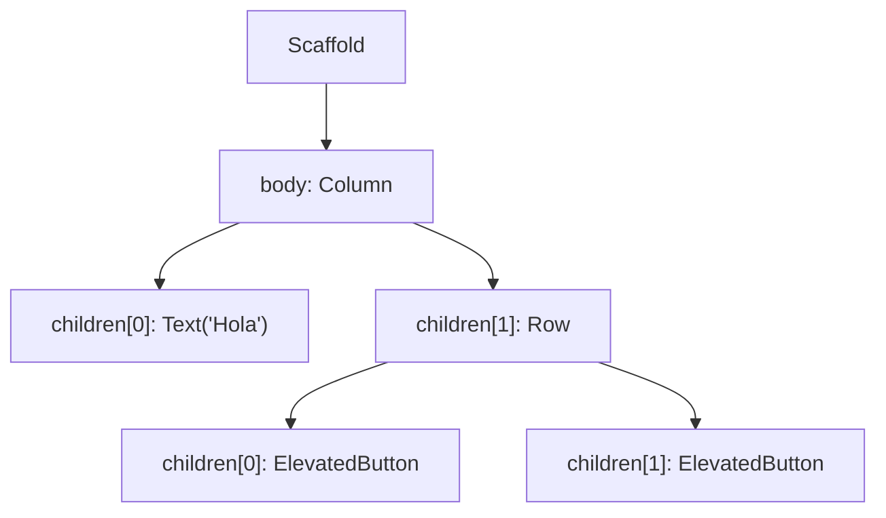

# Flutter — Biblioteca de Conceptos

Bootcamp de Desarrollo de Apps Móviles con Flutter — Código Facilito — Prof. Marines Méndez

> Este archivo se organiza por concepto, no cronológicamente. Para el orden real en que se dieron las clases, ver `../bitacora.md` y el historial de commits.
>
> Los fundamentos de desarrollo móvil (Android/iOS, pantallas, tipos de apps) están en [`../fundamentos/conceptos.md`](../fundamentos/conceptos.md); Dart como lenguaje está en el repo [`Curso-de-Dart`](https://github.com/DantheonHub/Curso-de-Dart). Este archivo asume ambos como base y se enfoca en Flutter como framework.
>
> Otras fuentes de esta sección: diapositivas oficiales de la cátedra ("Flutter básico" parte 1 y 2) y el repositorio de ejemplos de la profesora, [Marines0210/bootcamp_flutter](https://github.com/Marines0210/bootcamp_flutter).

## Índice

- [1. ¿Qué es un widget, en serio?](#1-qué-es-un-widget-en-serio)
- [2. El árbol de widgets: `child` y `children`](#2-el-árbol-de-widgets-child-y-children)
- [3. `BuildContext`: el "dónde estoy parado" de un widget](#3-buildcontext-el-dónde-estoy-parado-de-un-widget)
- [4. `Key`: identificar widgets entre sí](#4-key-identificar-widgets-entre-sí)
- [5. `StatelessWidget` vs. `StatefulWidget`](#5-statelesswidget-vs-statefulwidget)
- [6. `Scaffold` y `AppBar`: la anatomía de una pantalla](#6-scaffold-y-appbar-la-anatomía-de-una-pantalla)
- [7. Material vs. Cupertino](#7-material-vs-cupertino)
- [8. Layout: `Column`, `Row`, `Stack` y alineación](#8-layout-column-row-stack-y-alineación)
- [9. Espaciado: `Padding` vs. `margin`](#9-espaciado-padding-vs-margin)
- [10. Texto e íconos: `Text`, `RichText`, `Icon`](#10-texto-e-íconos-text-richtext-icon)
- [11. `Image` y `BoxFit`](#11-image-y-boxfit)
- [12. Botones](#12-botones)
- [13. `CircleAvatar`](#13-circleavatar)
- [14. `Card`](#14-card)
- [15. `Container`](#15-container)
- [16. Interactividad: `InkWell` vs. `GestureDetector`](#16-interactividad-inkwell-vs-gesturedetector)
- [17. `ListTile`](#17-listtile)
- [18. `SizedBox` y `Divider`](#18-sizedbox-y-divider)
- [19. Menús: `Drawer` y `BottomNavigationBar`](#19-menús-drawer-y-bottomnavigationbar)
- [20. Ventanas flotantes: `AlertDialog` y `showModalBottomSheet`](#20-ventanas-flotantes-alertdialog-y-showmodalbottomsheet)

---

## 1. ¿Qué es un widget, en serio?

Ya se vio que Flutter no depende de un puente hacia lo nativo porque tiene su propio motor de renderizado (ver `fundamentos/conceptos.md`, punto 9). Eso es justamente lo que hace que **todo en Flutter sea un widget**: no solo los botones o los textos, sino también el espaciado, la alineación, la animación y hasta la propia pantalla. Flutter no distingue entre "componentes visuales" y "configuración de layout" como sí lo hacen otros frameworks — todo se expresa con el mismo bloque de construcción.

Un **widget** no es, en rigor, "el dibujo en pantalla" — es una **descripción** de cómo debería verse una porción de la interfaz en un momento dado. Es un objeto inmutable (no se modifica a sí mismo una vez creado) que Flutter usa como instrucción para dibujar. Cuando algo tiene que cambiar visualmente (un contador que aumenta, un texto que cambia de color), lo que en realidad pasa **no es que el widget existente se edite**, sino que Flutter descarta la descripción vieja y construye una nueva, comparando ambas para actualizar solo lo que realmente cambió en pantalla — sin redibujar toda la interfaz desde cero. Esto es lo que hace que Flutter sea rápido incluso con animaciones e interfaces complejas.

> 📌 No hace falta memorizar el mecanismo interno completo (que involucra conceptos más avanzados, como el *Element tree* y el *RenderObject tree*, por detrás de lo que uno programa). Lo importante para uso diario es esta idea: **un widget describe cómo se ve algo, no es la cosa en sí** — y por eso, para "cambiar" algo en pantalla, hay que decirle a Flutter que reconstruya esa descripción (ver `setState()` en la sección 5), no ir a buscar el elemento visual y editarlo directamente como se haría con el DOM en una página web.

## 2. El árbol de widgets: `child` y `children`

Como todo es un widget, y los widgets se anidan unos dentro de otros, la interfaz completa de una app termina siendo una **estructura en forma de árbol**: un widget raíz que contiene otros widgets, que a su vez pueden contener otros, y así sucesivamente.

Esa relación de "esto contiene a esto otro" se expresa con dos propiedades, que se diferencian **únicamente en la cantidad de elementos que aceptan**:

| Propiedad | Acepta | Se usa en widgets que... | Ejemplos comunes |
|---|---|---|---|
| `child` | Un único widget | Diseñan, limitan o modifican a un solo elemento | `Container`, `Center`, `Padding`, `SizedBox` |
| `children` | Una `List<Widget>` (lista) | Organizan una colección de elementos de forma ordenada | `Column`, `Row`, `ListView`, `Stack` |

```dart
// child: un solo widget
Center(
  child: Text('Hola Mundo'),
)

// children: una lista de widgets
Column(
  children: [
    Text('Primer elemento'),
    Text('Segundo elemento'),
  ],
)
```

Un ejemplo simple de árbol, con `Scaffold` como raíz visual de la pantalla:



Cada nodo de ese árbol es, en sí mismo, un widget completo — con sus propios atributos, y potencialmente sus propios hijos. `Column` no sabe ni le importa qué hay dentro de cada uno de sus `children`; solo los acomoda uno debajo del otro.

> ⚠️ Widgets como `Padding`, `Container` o `InkWell` solo aceptan **un** `child`. Si hace falta que el mismo padding (o el mismo `onTap`) afecte a *varios* elementos a la vez, la solución no es "forzar" varios hijos ahí — es envolver esos elementos primero en una `Column` o `Row` (que sí aceptan `children`), y pasar esa `Column`/`Row` como el único `child`. Es una consecuencia directa de que la estructura sea un árbol: si un nodo solo permite una rama, para meter más de una cosa hace falta un nodo intermedio que sí las agrupe.

## 3. `BuildContext`: el "dónde estoy parado" de un widget

El **contexto** (`BuildContext`, casi siempre nombrado como el parámetro `context`) es un identificador que indica la ubicación exacta de un widget dentro del árbol de componentes de la aplicación. No es un dato que uno arme a mano: Flutter se lo pasa automáticamente a cada widget cuando lo construye (aparece como parámetro del método `build(BuildContext context)`).

¿Para qué sirve saber "dónde estoy parado"? Porque muchas operaciones necesitan ubicarse en el árbol para funcionar:

- **Abrir un diálogo o un modal por encima de la pantalla actual** (`showDialog(context: context, ...)`, `showModalBottomSheet(context: context, ...)`) — Flutter necesita saber sobre qué parte del árbol dibujar esa ventana flotante.
- **Cerrar la pantalla, el modal o el menú actual** (`Navigator.pop(context)`) — necesita saber *cuál* pantalla/modal cerrar, y eso depende de dónde se está parado.
- Acceder a temas, tamaños de pantalla, o a un widget ancestro (`Theme.of(context)`, `MediaQuery.of(context)`) — todos estos "buscan hacia arriba" en el árbol a partir del `context` que se les da.

Esto también explica algo importante: **un widget no se puede "llamar" directamente desde `main()`**. Flutter arma la interfaz recorriendo el árbol desde la raíz (`runApp()` hacia abajo); solo lo que está efectivamente ubicado dentro de esa jerarquía (por ejemplo, colocado en el `body` de un `Scaffold`, que a su vez está dentro de la app) tiene un `context` válido y es "visible" para el sistema. Crear un widget nuevo por separado, sin insertarlo en algún punto del árbol ya existente, no hace que aparezca en pantalla — hay que mandarlo a llamar desde un lugar del árbol que sí se esté construyendo.

## 4. `Key`: identificar widgets entre sí

Las **`Key`** son identificadores que le permiten al motor de Flutter distinguir un widget de otro cuando el árbol de la interfaz cambia — por ejemplo, cuando se reordenan, agregan o eliminan elementos de una lista dinámica. Sin una `Key`, Flutter identifica a los widgets por su posición y tipo dentro del árbol; si esa posición cambia (se inserta un elemento al principio de una lista, por ejemplo), Flutter puede "confundirse" y reutilizar el estado de un widget para otro que en realidad es distinto.

| Tipo de `Key` | Qué usa como identificador |
|---|---|
| `ValueKey` | Un valor simple ya existente, como un ID o un texto |
| `UniqueKey` | Un identificador completamente único y aleatorio, generado por Flutter |
| `GlobalKey` | Permite además **acceder al estado** de ese widget puntual desde cualquier otra parte de la aplicación |

> 📌 No hace falta usar `Key` en cada widget que se cree — es una herramienta puntual para cuando el árbol cambia dinámicamente (listas que se reordenan, elementos que aparecen/desaparecen) y Flutter necesita ayuda extra para no perder el rastro de cuál widget es cuál. Se retoma con más detalle al trabajar con listas dinámicas.

## 5. `StatelessWidget` vs. `StatefulWidget`

Flutter separa los widgets en dos grandes familias, según si necesitan **recordar y actualizar información propia** o no.

| | `StatelessWidget` | `StatefulWidget` |
|---|---|---|
| ¿Guarda datos que cambian con el tiempo? | No | Sí |
| ¿Se puede "redibujar a sí mismo" tras crearse? | No — solo cambia si su *padre* lo reconstruye con datos nuevos | Sí, con `setState()` |
| Ejemplos típicos | Un texto fijo, un ícono, una tarjeta de producto estática | Un contador, un formulario, un botón que cambia de estado |

**¿Por qué existe esta separación?** Por eficiencia: si Flutter tuviera que revisar *todos* los widgets de la app constantemente por si alguno cambió, sería carísimo en rendimiento. Al declarar explícitamente cuáles widgets pueden cambiar (`StatefulWidget`) y cuáles no (`StatelessWidget`), Flutter sabe de antemano qué partes del árbol necesita vigilar y cuáles puede dar por sentado que no van a cambiar solas.

**Ejemplo de `StatelessWidget`** — un texto enriquecido que nunca cambia una vez construido:

```dart
class RegisterText extends StatelessWidget {
  @override
  Widget build(BuildContext context) {
    return RichText(
      text: const TextSpan(
        text: '¿No tienes cuenta? ',
        style: TextStyle(color: Colors.black),
        children: <TextSpan>[
          TextSpan(
            text: 'Registrarme',
            style: TextStyle(fontWeight: FontWeight.bold),
          ),
        ],
      ),
    );
  }
}
```

**Ejemplo de `StatefulWidget`** — un botón que alterna entre dos estados ("Guardar" / "Editar") al tocarlo:

```dart
class SaveButton extends StatefulWidget {
  @override
  State<StatefulWidget> createState() => SaveButtonState();
}

class SaveButtonState extends State<SaveButton> {
  bool isSave = false;

  @override
  Widget build(BuildContext context) {
    return TextButton.icon(
      icon: Icon(isSave ? Icons.edit : Icons.save),
      label: Text(isSave ? "Editar" : "Guardar"),
      style: TextButton.styleFrom(
        foregroundColor: Colors.green,
        iconColor: Colors.green,
      ),
      onPressed: () {
        setState(() {
          isSave = !isSave;
        });
      },
    );
  }
}
```

Un `StatefulWidget` en realidad son **dos clases trabajando juntas**:

- La clase que extiende `StatefulWidget` (`SaveButton`) es, en los hechos, solo una fábrica: su único trabajo es crear el objeto `State` correspondiente (`createState()`).
- La clase que extiende `State<T>` (`SaveButtonState`) es donde realmente vive tanto el **estado** (las variables que pueden cambiar, como `isSave`) como el método `build()` que arma la interfaz a partir de ese estado.

**`setState()`** es el mecanismo para avisarle a Flutter "esto cambió, volvé a construir la interfaz": se llama dentro de la clase `State`, envolviendo la actualización de la variable (como en el ejemplo, `isSave = !isSave;` dentro de `setState()`). Sin el `setState()`, la variable cambiaría igual en memoria, pero Flutter **no se enteraría** de que tiene que redibujar nada — la pantalla se quedaría mostrando el valor viejo hasta que algo más disparara una reconstrucción.

> 📌 **Gestión de estado avanzada.** El patrón de `setState()` funciona bien para estado que le pertenece a un solo widget. Cuando la app crece y varias pantallas necesitan compartir y sincronizar los mismos datos (por ejemplo, el usuario logueado, o el contenido de un carrito de compras), se usan herramientas externas de manejo de estado como **Provider**, **BLoC** o **Riverpod** — temas que se retoman en el módulo de "Estructura y Manejo del Estado" del cronograma.

## 6. `Scaffold` y `AppBar`: la anatomía de una pantalla

`Scaffold` es el widget base que da la estructura típica de una pantalla de Material Design, con "espacios" predefinidos para las partes más comunes de una interfaz:

```dart
Scaffold(
  backgroundColor: Colors.grey[100],
  appBar: AppBar(
    title: Text("Home Page"),
  ),
  body: Center(
    child: Column(
      mainAxisAlignment: MainAxisAlignment.center,
      children: <Widget>[
        Text('You have pushed the button this many times:'),
        Text('0'),
      ],
    ),
  ),
  floatingActionButton: FloatingActionButton(
    onPressed: () {},
    child: Icon(Icons.add),
  ),
)
```

| Parámetro de `Scaffold` | Qué representa |
|---|---|
| `appBar` | La barra superior |
| `body` | El contenido principal de la pantalla |
| `floatingActionButton` | El botón circular flotante, típico de Material Design |
| `backgroundColor` | Color de fondo de toda la pantalla |
| `drawer` | El menú lateral (ver sección 19) |
| `bottomNavigationBar` | La barra de navegación inferior (ver sección 19) |

**`AppBar`** tiene, a su vez, sus propias propiedades:

| Propiedad | Descripción |
|---|---|
| `title` | Widget con el título o descripción del contenido actual de la pantalla (se puede personalizar con cualquier widget, no solo texto) |
| `key` | Opcional; identifica este widget puntual (ver sección 4) |
| `centerTitle` | Booleano; si es `true`, centra el `title` en la barra |
| `elevation` | Sombra debajo de la barra; debe ser mayor que 0 para que se note |
| `backgroundColor` | Color de relleno de la barra. Combinado con `Colors.transparent` y `elevation: 0` se logra una barra transparente |
| `toolbarHeight` | Altura personalizada de la barra (por ejemplo, 70, 80 o 100) |
| `actions` | Lista de widgets alineados a la derecha, después del `title` (íconos de búsqueda, notificaciones, menú de opciones, etc.) |
| `leading` | Widget mostrado *antes* del `title` — normalmente un ícono o botón (por ejemplo, el ícono del `Drawer`, que aparece automáticamente si el `Scaffold` tiene uno) |
| `bottom` | Widget ubicado en la parte inferior de la `AppBar` — típicamente una `TabBar` |

> 📌 **"Page", la nomenclatura correcta.** El propio framework de Flutter (su documentación, sus mensajes de error, widgets como `PageView`) llama **"page"** a una pantalla completa — es la nomenclatura oficial, y la que se va a seguir en este bootcamp (`home_page.dart`, `menu_page.dart`). No conviene adoptar "screen" como costumbre solo porque aparece seguido en tutoriales o proyectos de terceros: alinearse con el término que usa el propio framework evita inconsistencias más adelante, sobre todo al leer la documentación oficial o el código fuente de Flutter.

## 7. Material vs. Cupertino

Flutter ofrece dos bibliotecas de widgets con el mismo propósito (botones, interruptores, barras de navegación, etc.) pero con la apariencia de cada plataforma:

- **Material** (`package:flutter/material.dart`): sigue el lenguaje de diseño de Google, Material Design, adaptado para Android — es el que se usa por defecto en este bootcamp.
- **Cupertino** (`package:flutter/cupertino.dart`): imita el estilo clásico de Apple para iOS.

Además, Flutter permite una **personalización total**: se pueden crear diseños propios combinando widgets básicos, sin depender de los componentes nativos del teléfono en absoluto. Esto le permite a una misma base de código Flutter mostrarse "como una app nativa" tanto en Android como en iOS, si así se lo requiere — aunque en la práctica muchas apps multiplataforma usan Material en ambos sistemas para simplificar el diseño.

## 8. Layout: `Column`, `Row`, `Stack` y alineación

`Column` acomoda sus `children` uno debajo del otro (verticalmente); `Row` los acomoda uno al lado del otro (horizontalmente). Ambos comparten los mismos atributos de alineación, pero su significado depende de la dirección del widget:

- **Eje principal (*main axis*):** la dirección en la que el widget "fluye" — vertical en `Column`, horizontal en `Row`.
- **Eje transversal (*cross axis*):** la dirección perpendicular a esa — horizontal en `Column`, vertical en `Row`.

| Atributo | Controla alineación en el eje... |
|---|---|
| `mainAxisAlignment` | Principal |
| `crossAxisAlignment` | Transversal |
| `mainAxisSize` | Si el widget ocupa todo el espacio disponible en su eje principal (`.max`, por defecto) o solo lo que necesita su contenido (`.min`) |

Valores más usados para `mainAxisAlignment`/`crossAxisAlignment`:

| Valor | Efecto |
|---|---|
| `.start` | Agrupa todo al principio del eje (arriba, o a la izquierda) |
| `.end` | Agrupa todo al final del eje (abajo, o a la derecha) |
| `.center` | Centra todo en el eje |
| `.spaceBetween` | Reparte el espacio sobrante *entre* los elementos, sin dejar margen en los extremos |
| `.spaceAround` | Reparte el espacio sobrante alrededor de cada elemento (incluidos los extremos, con la mitad de espacio ahí) |
| `.spaceEvenly` | Reparte el espacio sobrante de manera exactamente pareja, incluidos los extremos |

```dart
Row(
  mainAxisAlignment: MainAxisAlignment.spaceAround,
  crossAxisAlignment: CrossAxisAlignment.center,
  mainAxisSize: MainAxisSize.min,
  children: [
    Icon(Icons.favorite),
    Icon(Icons.music_note),
  ],
)
```

**`Stack`** es un widget de layout distinto a los otros dos: en vez de acomodar a sus `children` uno al lado del otro o uno debajo del otro, los **superpone**, dibujándolos unos encima de otros en el mismo espacio (el primero de la lista queda más al fondo, el último más arriba). Sirve, por ejemplo, para poner una etiqueta o un ícono sobre una imagen. Se profundiza más adelante, cuando haga falta para diseños específicos — por ahora alcanza con saber que existe y cuál es su diferencia clave con `Column`/`Row`.

## 9. Espaciado: `Padding` vs. `margin`

Son dos formas de generar espacio, pero en lugares distintos respecto del "borde" de un widget:

- **`Padding`** (como widget, o como atributo `padding` de `Container`): espacio **interno** — empuja el contenido hacia adentro, alejándolo de los bordes del propio widget.
- **`margin`** (atributo de `Container`): espacio **externo** — aleja al widget completo de lo que lo rodea, por fuera de su propio borde.

```dart
Padding(
  padding: EdgeInsets.all(10),
  child: Text("Hola"),
)
```

`EdgeInsets` tiene variantes para especificar el espaciado en direcciones puntuales, en vez de aplicar el mismo valor en las cuatro:

| Constructor | Direcciones que afecta |
|---|---|
| `EdgeInsets.all(valor)` | Las cuatro direcciones por igual |
| `EdgeInsets.symmetric(horizontal: ..., vertical: ...)` | Izquierda+derecha con un valor, arriba+abajo con otro |
| `EdgeInsets.only(top: ..., bottom: ..., left: ..., right: ...)` | Cada dirección por separado, solo las que se indiquen |

## 10. Texto e íconos: `Text`, `RichText`, `Icon`

**`Text`** muestra una cadena de texto simple, con estilo controlado por `TextStyle` (color, tamaño, negrita, etc.):

```dart
Text(
  "Hola mundo",
  style: TextStyle(
    color: Colors.blue,
    fontSize: 25,
    fontWeight: FontWeight.bold,
  ),
)
```

**`RichText`** resuelve un caso que `Text` no puede: un mismo bloque de texto donde **distintas partes necesitan estilos distintos** (por ejemplo, una frase con una palabra en negrita en el medio). En vez de armar varios `Text` widgets separados, `RichText` recibe un único `TextSpan`, que a su vez puede tener `children` con más `TextSpan` anidados, cada uno con su propio estilo:

```dart
RichText(
  text: TextSpan(
    text: '¿No tienes cuenta? ',
    style: TextStyle(color: Colors.black),
    children: const <TextSpan>[
      TextSpan(
        text: 'Registrarme',
        style: TextStyle(fontWeight: FontWeight.bold),
      ),
    ],
  ),
)
```

**`Icon`** muestra un ícono de una de las fuentes de íconos incluidas en Flutter (`Icons.*`), con color y tamaño configurables:

```dart
Icon(
  Icons.favorite,
  color: Colors.pinkAccent,
  size: 40,
)
```

> 📌 **`TextFormField`** es el widget de Flutter para campos de entrada de texto editables por el usuario (formularios de login, registro, búsqueda, etc.). Se menciona acá porque aparece listado junto al resto de los widgets básicos, pero su uso completo (validación, controladores de texto, tipos de teclado) se retoma en el módulo de "Listas y formularios" del cronograma, cuando se trabaje específicamente con formularios.

## 11. `Image` y `BoxFit`

```dart
Image.network(
  "https://codigofacilito.com/avatar.jpg",
  height: 100,
  width: 100,
  fit: BoxFit.cover,
)
```

Cuando el tamaño de la imagen original no coincide exactamente con el espacio (`height`/`width`) asignado, `fit` (de tipo `BoxFit`) define cómo se **adapta** la imagen a ese espacio:

| Valor de `BoxFit` | Comportamiento |
|---|---|
| `none` | No escala la imagen; la muestra en su tamaño original, recortando lo que no entre |
| `scaleDown` | Como `none`, pero puede *achicar* la imagen si es más grande que el espacio (nunca la agranda) |
| `fitWidth` | Escala la imagen para que ocupe todo el ancho disponible, aunque se recorte verticalmente |
| `fitHeight` | Escala la imagen para que ocupe todo el alto disponible, aunque se recorte horizontalmente |
| `fill` | Estira la imagen para llenar exactamente el espacio, sin respetar su proporción original (puede deformarla) |
| `contain` | Escala la imagen para que entre completa dentro del espacio, respetando su proporción (puede dejar espacio vacío) |
| `cover` | Escala la imagen para cubrir *todo* el espacio, respetando su proporción (puede recortar los bordes que sobren) — el más usado para fotos de portada o fondo |

## 12. Botones

Flutter distingue varios tipos de botón según qué tan "importante" visualmente debe verse la acción:

| Widget | Apariencia | Cuándo usarlo |
|---|---|---|
| `TextButton` | Plano, sin fondo ni borde | Acciones secundarias, poco prioritarias |
| `OutlinedButton` | Con borde, sin relleno | Acciones intermedias — visibles pero no la acción principal |
| `ElevatedButton` | Con relleno de color y sombra (elevado) | La acción principal de la pantalla |
| `IconButton` / `TextButton.icon` / `ElevatedButton.icon` | Variante con ícono | Cuando conviene reforzar la acción con un ícono además del texto |

```dart
TextButton(
  child: const Text('Guardar'),
  style: TextButton.styleFrom(
    foregroundColor: Colors.green,
  ),
  onPressed: () {},
)

OutlinedButton(
  child: const Text('Guardar'),
  style: OutlinedButton.styleFrom(
    foregroundColor: Colors.green,
    side: BorderSide(width: 1.0, color: Colors.green),
  ),
  onPressed: () {},
)

TextButton.icon(
  icon: Icon(Icons.save),
  label: Text("Guardar"),
  style: TextButton.styleFrom(
    foregroundColor: Colors.green,
    iconColor: Colors.black,
  ),
  onPressed: () {},
)

ElevatedButton(
  child: const Text('Guardar'),
  style: ElevatedButton.styleFrom(
    backgroundColor: Colors.green,
    foregroundColor: Colors.black,
  ),
  onPressed: () {},
)
```

`styleFrom(...)` es el método común a todos los tipos de botón para personalizar su apariencia (color de fondo, color de texto/ícono, bordes) sin tener que armar un `ButtonStyle` completo a mano.

## 13. `CircleAvatar`

Widget pensado específicamente para mostrar una imagen de perfil circular:

```dart
CircleAvatar(
  radius: 48,
  backgroundImage: NetworkImage("https://codigofacilito.com/avatar.jpg"),
)
```

`backgroundImage` recibe un `ImageProvider` (`NetworkImage`, `AssetImage`) — la misma idea de "proveedor de imagen, no widget" que se usa en `DecorationImage` (ver sección 15).

## 14. `Card`

`Card` es un contenedor pensado para mostrar contenido "destacado". Sus características principales:

- **Elevación:** muestra una sombra que da la sensación de estar flotando sobre el fondo.
- **Versatilidad:** puede contener cualquier tipo de widget en su interior — textos, imágenes, columnas, botones.
- **Organización:** ayuda a separar visualmente la información para que la interfaz sea más limpia y clara.

Comparado con `Container` (sección 15), `Card` es **más limitado a propósito**: no tiene atributos de ancho/alto explícitos — se adapta automáticamente al tamaño de lo que tenga adentro (`child`). Lo que sí ofrece es una forma simple de lograr elevación y bordes redondeados sin tener que armarlos a mano.

```dart
Card(
  elevation: 4,
  shape: RoundedRectangleBorder(
    borderRadius: BorderRadius.circular(12),
    side: BorderSide(color: Colors.blue, width: 2),
  ),
  child: Padding(
    padding: EdgeInsets.all(16),
    child: Column(
      crossAxisAlignment: CrossAxisAlignment.start,
      children: [
        Image.network("https://...", fit: BoxFit.cover),
        Text("Título", style: TextStyle(fontSize: 30, fontWeight: FontWeight.bold)),
        Text("Descripción"),
        Row(
          mainAxisAlignment: MainAxisAlignment.end,
          children: [
            TextButton(onPressed: () {}, child: Text("Compartir")),
            TextButton(onPressed: () {}, child: Text("Explorar")),
          ],
        ),
      ],
    ),
  ),
)
```

Notar el patrón visto en la sección 2: como `Card` y `Padding` solo aceptan un `child`, todo el contenido (imagen, título, descripción, botones) se agrupa primero en una `Column`, y esa `Column` es el único hijo que ambos reciben.

- `shape: RoundedRectangleBorder(...)` permite personalizar el borde: `borderRadius` para las esquinas redondeadas, y `side: BorderSide(color: ..., width: ...)` para el color y grosor del borde.
- `mainAxisAlignment: MainAxisAlignment.end` en la fila de botones los agrupa hacia la derecha; `.spaceBetween` los separaría uno de cada extremo.

## 15. `Container`

`Container` es, en esencia, un widget "todo terreno" para layout y decoración: a diferencia de `Card`, sí permite especificar explícitamente `width`, `height`, `margin`, `padding`, `alignment`, y una **decoración** completa (`decoration`).

```dart
Container(
  width: 200,
  height: 200,
  padding: EdgeInsets.all(16),
  alignment: Alignment.center,
  decoration: BoxDecoration(
    color: Colors.blue, // OJO: no puede coexistir con Container(color: ...) directo
  ),
  child: Text("Hola mundo"),
)
```

> ⚠️ `Container` tiene su propio atributo `color`, pero **no se puede usar al mismo tiempo** que `color` dentro de `decoration: BoxDecoration(...)` — Flutter tira error, porque son dos formas de definir lo mismo y no sabe cuál priorizar. Regla práctica: si se necesita `decoration` para cualquier otra cosa (bordes, degradado, imagen de fondo), el color también tiene que ir *adentro* de esa `BoxDecoration`, no como atributo directo del `Container`.

**`BoxDecoration`** es donde vive casi toda la personalización visual de un `Container`:

- **`shape`**: forma general (`BoxShape.rectangle` por defecto, o `BoxShape.circle`).
- **`borderRadius`**: esquinas redondeadas.
  - `BorderRadius.circular(20)` redondea las **cuatro** esquinas por igual.
  - `BorderRadius.only(topLeft: Radius.circular(50), topRight: Radius.circular(50))` redondea **solo** las esquinas indicadas — el resto quedan en ángulo recto. Es la técnica para lograr, por ejemplo, una forma de "burbuja de chat" (esquinas superiores redondeadas, inferiores en ángulo recto).
- **`gradient`**: degradado de colores, en vez de un color sólido.

```dart
decoration: BoxDecoration(
  gradient: LinearGradient(
    colors: [Colors.blue, Colors.purple],
    begin: Alignment.topLeft,
    end: Alignment.bottomRight,
  ),
),
```
`colors` es la lista de colores del degradado (en orden); `begin` y `end` son dos puntos (`Alignment`) que definen la dirección en la que se recorre ese degradado — de arriba-izquierda a abajo-derecha, en este ejemplo, genera una diagonal.

- **`image`**: imagen de fondo, con `DecorationImage`:

```dart
decoration: BoxDecoration(
  image: DecorationImage(
    image: AssetImage("assets/fondo.png"),
    fit: BoxFit.cover,
  ),
),
```

> 📌 **`Image` (widget) vs. `AssetImage`/`NetworkImage` (proveedores de imagen).** `Image.asset(...)` o `Image.network(...)` son **widgets completos**: ocupan un lugar en el árbol y se pueden usar como `child` de cualquier cosa, tal como se ve en el ejemplo del `Card` de la sección 14. `AssetImage(...)` y `NetworkImage(...)`, en cambio, **no son widgets** — son solo una referencia a *dónde* está la imagen (un `ImageProvider`), pensada para pasarse como parámetro a otras cosas que sí saben qué hacer con esa imagen, como `DecorationImage` (dentro de `BoxDecoration`) o `CircleAvatar` (sección 13). La diferencia importa porque son intercambiables solo en el contexto correcto: no se puede poner un `AssetImage` directamente como `child` de un `Container`, porque no es un widget.

Un container también puede combinar varias de estas técnicas a la vez — por ejemplo, un contenedor con degradado de fondo, sombra, y bordes redondeados solo arriba, conteniendo internamente otro `Container` con esquinas redondeadas invertidas, un `Divider`, y una lista de `ListTile` — el mismo patrón de "widgets simples combinados" que se usa para diseños más elaborados de catálogo o chat.

## 16. Interactividad: `InkWell` vs. `GestureDetector`

Ambos son widgets "invisibles" que envuelven a otro widget para hacerlo interactivo — la diferencia está en qué tan simple o completo es el conjunto de gestos que reconocen, y si dan una respuesta visual automática.

| | `InkWell` | `GestureDetector` |
|---|---|---|
| Propósito | Crear áreas interactivas bajo las guías de Material Design | Detectar una gran variedad de gestos táctiles complejos |
| Gestos que reconoce | Toque simple (`onTap`), pulsación larga (`onLongPress`) | Toques, doble toque, pulsación larga, arrastrar (*drag*), zoom (*scale*), deslizamiento (*swipe*) |
| Respuesta visual | Automática — efecto de onda (*ripple*) de Material al tocar | Ninguna por defecto — hay que armarla manualmente si se quiere |
| Cuándo usarlo | Botones, tarjetas (`Card`) o elementos de lista donde el usuario espera la respuesta visual inmediata típica de Material Design | Áreas interactivas personalizadas, imágenes, o gestos avanzados donde no se necesita (o no se quiere) el diseño Material |

```dart
InkWell(
  onTap: () {
    print("Se hizo click");
  },
  onLongPress: () {
    print("Se mantuvo presionado");
  },
  child: Card(/* ... */),
)
```

En la práctica: para el caso más común (un `Card` o `Container` que se pueda tocar, con la sensación visual esperable de Material Design), `InkWell` alcanza y sobra. `GestureDetector` queda para más adelante, cuando haga falta reconocer gestos que `InkWell` no cubre (arrastrar, hacer zoom, deslizar).

## 17. `ListTile`

Un `ListTile` es un widget prediseñado que representa una fila fija con un formato estándar de Material Design, ideal para mostrar elementos dentro de una lista — sin necesidad de armar el layout a mano con `Row`/`Column`:

```dart
ListTile(
  leading: Icon(Icons.message),
  title: Text("Item 3"),
  subtitle: Text("Slide left or right"),
  trailing: Icon(Icons.arrow_back),
)
```

| Parámetro | Ubicación |
|---|---|
| `leading` | Widget a la izquierda (típicamente un ícono) |
| `title` | Texto principal |
| `subtitle` | Texto secundario, debajo del título |
| `trailing` | Widget a la derecha (típicamente un ícono de flecha, indicando que lleva a otra pantalla) |

Es el patrón habitual en menús y listas de navegación: un ícono identificando la opción a la izquierda, el texto en el medio, y una flecha a la derecha sugiriendo que tocar esa fila abre algo más.

> 📌 El mismo resultado visual de un `ListTile` simple se podría armar a mano combinando un `Row` con un `Icon`, una `Column` de dos `Text` (título y subtítulo), y otro `Icon` al final — pero `ListTile` ya resuelve el espaciado y la alineación correctos por defecto, evitando repetir ese layout manualmente cada vez.

## 18. `SizedBox` y `Divider`

- **`SizedBox`**: widget "vacío" cuyo único propósito es imponerle un ancho y/o alto explícitos a su `child` — o, sin `child`, actuar como un espacio en blanco de tamaño fijo entre dos widgets (por ejemplo, `SizedBox(height: 16)` entre dos elementos de una `Column`, a modo de separador sin necesidad de márgenes).
- **`Divider`**: una línea horizontal simple, usada para separar visualmente elementos de una lista. Se puede personalizar color y grosor:

```dart
Divider(color: Colors.black, thickness: 2)
```

## 19. Menús: `Drawer` y `BottomNavigationBar`

Son componentes de interfaz usados para navegar entre las secciones principales de una aplicación móvil — dos formas distintas de resolver lo mismo, con ubicaciones y comportamientos distintos.

**`Drawer`** es un menú lateral que se desliza desde el borde de la pantalla. Se asigna directamente al atributo `drawer` del `Scaffold`; al hacerlo, Flutter agrega **automáticamente** el ícono de "hamburguesa" en el `AppBar` para abrirlo (no hace falta programarlo a mano).

```dart
Scaffold(
  appBar: AppBar(title: Text("Inicio")),
  drawer: Drawer(
    child: ListView(
      children: [
        UserAccountsDrawerHeader(
          accountName: Text("Marines"),
          accountEmail: Text("marines@codigofacilito.com"),
          currentAccountPicture: CircleAvatar(child: Icon(Icons.person)),
        ),
        ListTile(leading: Icon(Icons.home), title: Text("Inicio"), onTap: () {}),
        ListTile(leading: Icon(Icons.person), title: Text("Perfil"), onTap: () {}),
        ListTile(leading: Icon(Icons.settings), title: Text("Ajustes"), onTap: () {}),
      ],
    ),
  ),
  body: /* contenido según la opción seleccionada */,
)
```

`UserAccountsDrawerHeader` es un widget de Flutter ya armado específicamente para la cabecera típica de un `Drawer` (nombre, correo y avatar), sin tener que diseñarla desde cero.

**`BottomNavigationBar`** cumple el mismo rol de navegación, pero como una barra fija en la parte inferior de la pantalla:

```dart
BottomNavigationBar(
  currentIndex: _index,
  onTap: (nuevoIndex) {
    setState(() {
      _index = nuevoIndex;
    });
  },
  items: [
    BottomNavigationBarItem(icon: Icon(Icons.home), label: "Inicio"),
    BottomNavigationBarItem(icon: Icon(Icons.person), label: "Perfil"),
  ],
)
```

> ⚠️ `BottomNavigationBar` exige **como mínimo dos** `items` — con uno solo, Flutter tira error (no tendría sentido una barra de navegación con una sola opción).

**El patrón común a ambos** (y, en general, a cualquier navegación por índice): se guarda un `int` como estado (por ejemplo `_index`), que representa qué sección está activa. Cada `onTap` actualiza ese índice dentro de un `setState()`, y ese mismo índice se usa para decidir qué mostrar en el `body` — típicamente indexando una lista de widgets ya armados (`paginas[_index]`), o con un `switch`.

`currentIndex` en `BottomNavigationBar` es lo que hace que la opción activa quede visualmente resaltada — sin ese atributo sincronizado con el estado, la barra no "recordaría" cuál sección está mostrándose.

> ⚠️ **`Navigator.pop(context)`** cierra la pantalla, el menú o el modal que esté abierto actualmente por encima de todo lo demás — por ejemplo, para cerrar el `Drawer` después de seleccionar una opción (si no, el menú se queda abierto tras el click). Si se llama `pop()` estando en la pantalla principal, sin ningún `Drawer`/modal abierto encima, lo que se cierra es **la aplicación completa**, porque no hay nada "por encima" para cerrar. Esto se retoma con más cuidado cuando se vea navegación entre pantallas (rutas) más adelante.
>
> Por diseño, no se recomienda usar `Drawer` y `BottomNavigationBar` al mismo tiempo en una app real — sirven para lo mismo, y combinarlos suele saturar al usuario con demasiadas formas de navegar. Se usan juntos en los ejemplos de clase solo a modo de comparación.

## 20. Ventanas flotantes: `AlertDialog` y `showModalBottomSheet`

Son componentes visuales de Flutter que muestran información en primer plano sobre la pantalla actual, sin navegar a una pantalla nueva — pero pensados para objetivos y lugares diferentes.

**`AlertDialog`** (mostrado con `showDialog`) es una ventana emergente que aparece centrada sobre la pantalla, pensada para pedir confirmación o una decisión importante del usuario antes de continuar:

```dart
showDialog(
  context: context,
  builder: (context) => AlertDialog(
    title: Text("Eliminar elemento"),
    content: Text("¿Estás seguro de que deseas eliminar este registro?"),
    actions: [
      TextButton(
        onPressed: () => Navigator.pop(context),
        child: Text("Cancelar"),
      ),
      TextButton(
        onPressed: () {
          // acción de eliminar
          Navigator.pop(context);
        },
        child: Text("Eliminar"),
      ),
    ],
  ),
);
```

- **`title`**: explica el motivo de la alerta (ej. "¿Deseas salir?").
- **`content`**: muestra detalles o un texto descriptivo.
- **`actions`**: botones como "Cancelar" o "Aceptar" para que el usuario responda.
- **Cierre (`Navigator.pop`)**: sirve para cerrar la ventana cuando el usuario toca un botón — sin esto, el diálogo se quedaría abierto para siempre.

**`showModalBottomSheet`**: una ventana que se desliza desde abajo, ocupando parte de la pantalla — típica para mostrar opciones adicionales o contenido secundario sin abandonar la vista actual.

```dart
showModalBottomSheet(
  context: context,
  builder: (context) => SizedBox(
    height: 200,
    child: Center(
      child: Column(
        mainAxisAlignment: MainAxisAlignment.center,
        children: [
          Text("Este es un modal"),
          TextButton(
            onPressed: () => Navigator.pop(context),
            child: Text("Cerrar"),
          ),
        ],
      ),
    ),
  ),
);
```

Se puede cerrar tocando fuera de él o con el gesto de retroceso, pero conviene siempre agregar un botón explícito de cerrar — muchos usuarios no dan por sentado que se puede descartar tocando afuera, y un botón visible deja claro que la ventana se puede cerrar.
