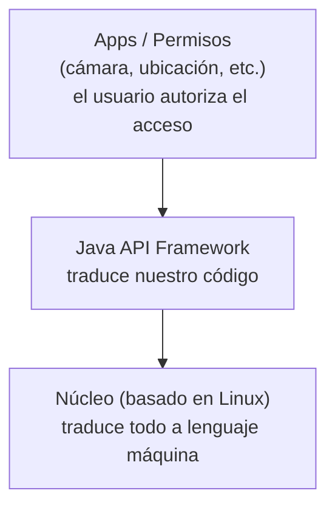
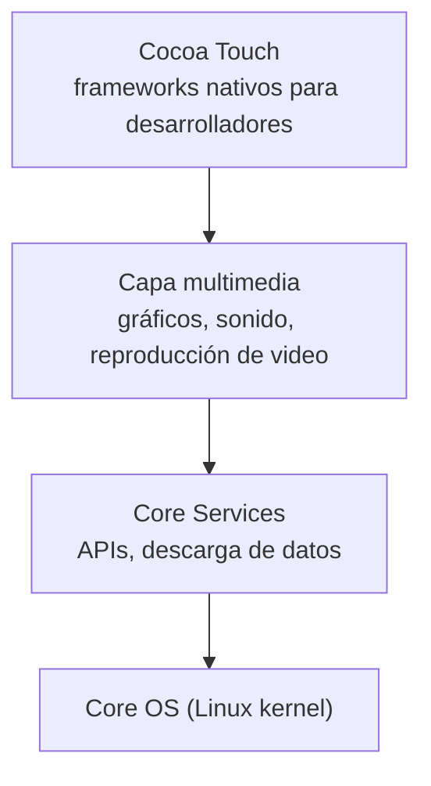

# Desarrollo Móvil — Biblioteca de Conceptos

Bootcamp de Desarrollo de Apps Móviles con Flutter — Código Facilito — Prof. Marines Méndez

> Este archivo se organiza por concepto, no cronológicamente. Para el orden real en que se dieron las clases, ver `bitacora.md` y el historial de commits.

## Índice

- [Desarrollo Móvil — Biblioteca de Conceptos](#desarrollo-móvil--biblioteca-de-conceptos)
  - [Índice](#índice)
  - [1. ¿Qué es un dispositivo móvil?](#1-qué-es-un-dispositivo-móvil)
  - [2. Sistemas operativos](#2-sistemas-operativos)
    - [2.1 Arquitectura de Android](#21-arquitectura-de-android)
    - [2.2 Arquitectura de iOS](#22-arquitectura-de-ios)
  - [3. Fragmentación y niveles de API](#3-fragmentación-y-niveles-de-api)
  - [4. Privacidad del usuario](#4-privacidad-del-usuario)
  - [5. Pantallas: tamaño, resolución y densidad](#5-pantallas-tamaño-resolución-y-densidad)
    - [5.1 Unidades: dp, sp y pt](#51-unidades-dp-sp-y-pt)
  - [6. Evolución del diseño de interfaces](#6-evolución-del-diseño-de-interfaces)
  - [7. Widgets, SDKs y frameworks nativos de UI](#7-widgets-sdks-y-frameworks-nativos-de-ui)
  - [8. Almacenamiento en apps](#8-almacenamiento-en-apps)
  - [9. Tipos de desarrollo de apps](#9-tipos-de-desarrollo-de-apps)
  - [10. Ruta de aprendizaje del bootcamp](#10-ruta-de-aprendizaje-del-bootcamp)

---

## 1. ¿Qué es un dispositivo móvil?

Un **dispositivo móvil** es un aparato electrónico portátil con capacidad de cómputo propia (procesador, memoria, sistema operativo) y, generalmente, conexión a internet, diseñado para poder trasladarse y usarse en cualquier lugar (smartphones, tablets, smartwatches, etc.). A diferencia de una computadora de escritorio, corre un **sistema operativo móvil** (Android, iOS) pensado para pantallas táctiles, batería limitada y conectividad inalámbrica constante.

Al inicio del desarrollo móvil, los fabricantes eran bastante restrictivos con estos dispositivos: solo se podían usar las apps que la propia empresa ofrecía, sin posibilidad de que desarrolladores externos crearan las suyas. La apertura hacia desarrolladores externos (a través de SDKs y tiendas de aplicaciones) llegó después, y es lo que permitió que hoy exista todo un ecosistema de apps de terceros.

## 2. Sistemas operativos

Al programar existen distintas **capas** entre el código que escribimos y el hardware. El **sistema operativo** es el software base que administra los recursos del dispositivo (procesador, memoria, pantalla, sensores) y traduce nuestro código a instrucciones que la máquina entiende (ceros y unos). Los dos sistemas operativos móviles principales son **Android** (Google) e **iOS** (Apple).

### 2.1 Arquitectura de Android



Google no da acceso libre a todo el dispositivo: ciertas funciones (cámara, ubicación, etc.) requieren que el usuario otorgue permisos explícitos. A diferencia de Apple, Android tiene convenios con múltiples fabricantes (Xiaomi, Samsung, Oppo, etc.), por lo que cada dispositivo puede variar bastante en hardware (número de cámaras, lector de huellas, lápiz óptico, etc.).

### 2.2 Arquitectura de iOS

Es una arquitectura más simple y más controlada: Apple es más estricta con lo que se puede desarrollar y publicar.



De ambas arquitecturas, las capas más relevantes para el desarrollo de apps son **Java API Framework** (Android) y **Cocoa Touch** (iOS): son las que exponen a los desarrolladores las herramientas para construir la interfaz y acceder a las funciones del dispositivo.

## 3. Fragmentación y niveles de API

Android, al tener múltiples fabricantes, sufre de **fragmentación**: existen muchas versiones del sistema operativo funcionando simultáneamente en distintos dispositivos, y es necesario enviar actualizaciones para corregir errores en cada una.

- **Nivel de API (API level):** número que indica qué versión del framework soporta un dispositivo.
- Al elegir la versión mínima de API que soportará la app, se define qué porcentaje de dispositivos podrán instalarla (ej: apuntar a Android Oreo dejaría fuera al ~3% de dispositivos más antiguos, según el ejemplo visto en clase).
- Es importante revisar la tabla de niveles de API antes de decidir con qué versión mínima construir la app.
- Como desarrolladores, nos adaptamos a los lineamientos que define Google, no al revés.
- Muchas apps son retiradas de las tiendas por no mantenerse actualizadas a la versión de API exigida → **el mantenimiento es necesario**, no opcional.

## 4. Privacidad del usuario

Hoy la privacidad se restringe mucho más que al inicio del desarrollo móvil, porque un dispositivo actual concentra información sensible (fotos, cuentas bancarias, notas, etc.). Como desarrolladores no podemos acceder a todo libremente: debemos solicitar permisos explícitos para las funciones que los requieran (ej: una app de cámara debe pedir permiso de cámara).

## 5. Pantallas: tamaño, resolución y densidad

**Tamaño de pantalla:** se mide en pulgadas y se calcula con el teorema de Pitágoras sobre la diagonal de la pantalla:

```
diagonal = √(ancho² + alto²)
```

Ejemplo con los valores vistos en clase:

```
diagonal = √(4.35² + 2.45²) ≈ 4.99 pulgadas
```

**Resolución:** cantidad de píxeles que forman la pantalla (ancho × alto). Cada píxel está compuesto por 3 subpíxeles de color (rojo, verde y azul) que se combinan para formar la imagen.

**Densidad (DPI/PPI):** es la cantidad de píxeles que caben en una pulgada física de pantalla. Se expresa en **PPI** (*pixels per inch*), aunque en la práctica se suele usar el término **DPI** (*dots per inch*, tomado de la impresión) como sinónimo. Se calcula dividiendo la resolución diagonal (en píxeles) entre el tamaño diagonal de la pantalla (en pulgadas):

```
PPI = resolución diagonal (px) / tamaño de pantalla (pulgadas)
```

A mayor densidad, más píxeles caben en la misma superficie física → los elementos se ven más nítidos, pero también más pequeños si se miden en píxeles crudos.

Esto genera un problema de consistencia visual: un mismo elemento de, por ejemplo, 3x8 píxeles se verá:

- Bien en una pantalla de **densidad baja** (low density)
- Pequeño en una de **densidad media** (medium density)
- Muy pequeño en una de **densidad alta** (high density), porque hay más píxeles ocupando el mismo espacio físico

Android agrupa las densidades reales de los dispositivos en "cubetas" (*density buckets*), tomando como base **mdpi** (160 dpi = escala 1x):

| Bucket | Densidad aprox. | Factor de escala (vs. mdpi) |
|---|---|---|
| ldpi | ~120 dpi | 0.75x |
| mdpi (base) | ~160 dpi | 1x |
| hdpi | ~240 dpi | 1.5x |
| xhdpi | ~320 dpi | 2x |
| xxhdpi | ~480 dpi | 3x |
| xxxhdpi | ~640 dpi | 4x |

Esto es lo que resuelven las unidades `dp`/`sp`/`pt` de la siguiente sección: en vez de definir tamaños en píxeles crudos (que se ven distinto según el bucket), se definen en unidades independientes de la densidad, y el sistema operativo se encarga de escalarlas según el bucket real del dispositivo.

### 5.1 Unidades: dp, sp y pt

Para evitar que el diseño se vea deforme o inconsistente según el dispositivo, se crearon unidades independientes de la densidad física de la pantalla:

| Unidad | Plataforma | Uso |
|---|---|---|
| `pt` | iOS | Unidad de diseño, escala automáticamente según el dispositivo |
| `dp` | Android | Unidad de diseño independiente de la densidad ("density-independent pixels") |
| `sp` | Android e iOS | Igual que `dp`, pero además respeta el tamaño de texto configurado por el usuario |

- En una pantalla de densidad base, **1dp ≈ 1px**.
- **dp** se usa para diseño en general (layouts, tamaños de elementos).
- **sp** se usa específicamente para texto: toma en cuenta si el usuario cambió el tamaño de fuente en la configuración del dispositivo y escala el texto en consecuencia.

Este concepto es clave porque **Flutter** (creado por Google) trabaja con esta misma lógica de unidades independientes de densidad.

## 6. Evolución del diseño de interfaces

| Estilo | Período | Características |
|---|---|---|
| **Skeuomorfismo** | 2007–2012 | Diseño literal, imitando objetos reales (la cámara parece una cámara, las notas parecen papel, los libros una biblioteca). Buscaba que el usuario entendiera qué representaba cada elemento. |
| **Diseño plano (Flat Design)** | 2013–2016 | Sin sombras ni relieve. Problema: a veces no quedaba claro si un elemento era interactivo (botón) o solo decorativo. |
| **Neumorfismo / Glassmorfismo** | 2020 en adelante | Vuelve a incorporar profundidad y efectos visuales (sombras suaves, transparencias). |

- **iOS** usa más **glassmorfismo**.
- **Android** usa **Material Design 3**, y en algunos casos combina también glassmorfismo.
- Son estándares de diseño a los que hay que adaptarse. **Flutter usa Material Design 3** como base.

## 7. Widgets, SDKs y frameworks nativos de UI

> **Framework:** conjunto de herramientas, bibliotecas y convenciones que da una estructura ya definida para construir un tipo de software, en vez de programarlo todo desde cero.
>
> **SDK (Software Development Kit):** conjunto de herramientas, bibliotecas, documentación y utilidades necesarias para desarrollar software para una plataforma específica (compilador, emulador, APIs, etc.). Un framework suele ser parte de lo que trae un SDK.

| Plataforma | Framework de UI declarativo |
|---|---|
| iOS | SwiftUI |
| Android | Jetpack Compose |

> Jetpack Compose tomó como referencia varias ideas de Flutter: el desarrollo nativo de Android se rediseñó basándose en conceptos que Flutter ya utilizaba.

Los **widgets** son los encargados de manejar el diseño (equivalente a un canvas + eventos). Para funciones que requieren hardware o servicios del sistema (ubicación, bluetooth, audio, sensores, cámara, etc.) se usa **código nativo** de la plataforma, no widgets.

## 8. Almacenamiento en apps

- **Almacenamiento interno:** vive en el propio dispositivo. Riesgo: si el dispositivo se rompe o es robado, se pierden los datos. Incluye:
  - **Preferencias compartidas (shared preferences):** almacenamiento clave-valor simple, útil para configuraciones (ej: modo oscuro true/false).
  - **Bases de datos SQLite:** almacenamiento local estructurado.
- **Almacenamiento externo:** los datos se guardan en un servidor externo, al que se accede mediante una conexión de red (LAN/WAN).
- **MBaaS (Mobile Backend as a Service):** soluciones como **Firebase** o **Supabase**, que ofrecen backend ya construido (autenticación, notificaciones, base de datos, etc.) de forma más simple, mediante configuración en vez de programarlo desde cero. Están orientadas específicamente a apps móviles.
- **Consumo de servicios web:** mediante **REST**, **SOAP** o **GraphQL**. Es la opción más compleja de las mencionadas, ya que implica manejar comunicación con APIs externas.

## 9. Tipos de desarrollo de apps

**App nativa**
- Se desarrolla con el lenguaje/SDK propio de cada plataforma.
- Requiere conocer los lenguajes nativos de cada sistema.
- Desventaja: hay que mantener el código por duplicado (uno para Android, otro para iOS) → mayor costo.

**App híbrida**
- Combina nativo + web (WebView en iOS y Android).
- En la práctica, es mostrar una página web dentro de un contenedor de app. Surgió porque algunas empresas simplemente subían su sitio web envuelto en un WebView a las tiendas de apps.
- Para acceder a servicios/hardware del dispositivo se usa un **bridge** (puente) que traduce el código web a funciones nativas.

**App multiplataforma**
- Un mismo código sirve para móvil, escritorio y web.
- **React Native vs. Flutter:**
  - React Native usa un **doble puente** (bridge) para comunicarse con lo nativo, lo que puede generar una experiencia menos fluida que una app nativa.
  - **Flutter** creó su propio motor de renderizado de widgets, por lo que **no depende de un puente** para dibujar la UI. Para acceder a servicios nativos usa **platform channels** (más limitado, pero se pueden crear canales propios).
  - Al pertenecer a Google, Flutter tiene el respaldo de la empresa detrás.

## 10. Ruta de aprendizaje del bootcamp

1. Introducción al desarrollo móvil
2. Dart
3. Introducción a Flutter
4. Patrones arquitectónicos y de diseño
5. Manejadores de estado
6. Bases de datos con SQLite
7. Consumir servicios web
8. Subir la app a la Play Store

**Herramientas a instalar:**
- **Flutter SDK**
- **Android Studio**
- Alternativa más liviana para emulación: **Genymotion**
- También se puede probar la app directamente en un celular físico.

---
